<!-- GENERATED:MODEL -->
---
tags: [odoo, enterprise, generated, model]
---

# l10n_uk.hmrc.send.wizard

- Module: [[docs/Enterprise Addons/l10n_uk_reports/l10n_uk_reports|l10n_uk_reports]]
- Scope: Enterprise Addons
- Defined in module: yes
- Source files: `wizard/hmrc_send_wizard.py`
- Python classes: `L10n_UkHmrcSendWizard`
- Description: HMRC Send Wizard

## Field footprint

- Detected fields: 4
- Field types: `Boolean` x 2, `Char` x 1, `Many2one` x 1
- Relation fields: 1

## Sample fields

- `accept_legal`: `Boolean` (comodel `Accept Legal Statement`)
- `hmrc_gov_client_device_id`: `Char`
- `message`: `Boolean` (comodel `Message`)
- `obligation_id`: `Many2one` (comodel `l10n_uk.vat.obligation`)

## Method hints

- Detected methods: 1
- Action methods: none
- Compute methods: none
- Onchange methods: none

## Direct relation diagram

```plantuml
@startuml
!define ODOO_COLOR_PRIMARY #714B67
!define ODOO_COLOR_ACCENT #875A7B
!define ODOO_COLOR_BG #FAF7FA

skinparam backgroundColor ODOO_COLOR_BG
skinparam defaultTextAlignment left
skinparam ArrowColor ODOO_COLOR_ACCENT
skinparam ClassBackgroundColor white
skinparam ClassBorderColor ODOO_COLOR_PRIMARY
skinparam ComponentBackgroundColor white
skinparam ComponentBorderColor ODOO_COLOR_PRIMARY
skinparam NoteBackgroundColor #FFF8FF
skinparam NoteBorderColor ODOO_COLOR_ACCENT
skinparam SequenceLifeLineBorderColor ODOO_COLOR_ACCENT
skinparam SequenceLifeLineBackgroundColor #FFFFFF
skinparam SequenceParticipantBorderColor ODOO_COLOR_PRIMARY
skinparam SequenceParticipantBackgroundColor #FFFFFF
skinparam sequence {
  ArrowColor ODOO_COLOR_ACCENT
  ActorBorderColor ODOO_COLOR_PRIMARY
}
title l10n_uk.hmrc.send.wizard - Direct Relations
class "l10n_uk.hmrc.send.wizard" as l10n_uk_hmrc_send_wizard
class "l10n_uk.vat.obligation" as l10n_uk_vat_obligation
l10n_uk_hmrc_send_wizard --> l10n_uk_vat_obligation : obligation_id
@enduml
```

## Navigation

- **Parent:** [[docs/Enterprise Addons/l10n_uk_reports/Models]]

<!-- GENERATED:MODEL -->
