<!-- GENERATED:MODEL -->
---
tags: [odoo, enterprise, generated, model]
---

# l10n_uk.vat.obligation

- Module: [[docs/Enterprise Addons/l10n_uk_reports/l10n_uk_reports|l10n_uk_reports]]
- Scope: Enterprise Addons
- Defined in module: yes
- Source files: `models/hmrc_vat_obligation.py`
- Python classes: `L10n_UkVatObligation`
- Description: HMRC VAT Obligation
- Inherits: `mail.activity.mixin`, `mail.thread`

## Field footprint

- Detected fields: 7
- Field types: `Char` x 1, `Date` x 4, `Many2one` x 1, `Selection` x 1
- Relation fields: 1

## Sample fields

- `company_id`: `Many2one` (comodel `res.company`)
- `date_due`: `Date` (comodel `Period Due`)
- `date_end`: `Date` (comodel `Period End`)
- `date_received`: `Date` (comodel `Received Submission date`)
- `date_start`: `Date` (comodel `Period Start`)
- `period_key`: `Char` (comodel `Period Key`)
- `status`: `Selection`

## Method hints

- Detected methods: 7
- Action methods: `action_submit_vat_return`
- Compute methods: `_compute_display_name`
- Onchange methods: none

## Direct relation diagram

```plantuml
@startuml
!define ODOO_COLOR_PRIMARY #714B67
!define ODOO_COLOR_ACCENT #875A7B
!define ODOO_COLOR_BG #FAF7FA

skinparam backgroundColor ODOO_COLOR_BG
skinparam defaultTextAlignment left
skinparam ArrowColor ODOO_COLOR_ACCENT
skinparam ClassBackgroundColor white
skinparam ClassBorderColor ODOO_COLOR_PRIMARY
skinparam ComponentBackgroundColor white
skinparam ComponentBorderColor ODOO_COLOR_PRIMARY
skinparam NoteBackgroundColor #FFF8FF
skinparam NoteBorderColor ODOO_COLOR_ACCENT
skinparam SequenceLifeLineBorderColor ODOO_COLOR_ACCENT
skinparam SequenceLifeLineBackgroundColor #FFFFFF
skinparam SequenceParticipantBorderColor ODOO_COLOR_PRIMARY
skinparam SequenceParticipantBackgroundColor #FFFFFF
skinparam sequence {
  ArrowColor ODOO_COLOR_ACCENT
  ActorBorderColor ODOO_COLOR_PRIMARY
}
title l10n_uk.vat.obligation - Direct Relations
class "l10n_uk.vat.obligation" as l10n_uk_vat_obligation
class "res.company" as res_company
l10n_uk_vat_obligation --> res_company : company_id
@enduml
```

## Navigation

- **Parent:** [[docs/Enterprise Addons/l10n_uk_reports/Models]]

<!-- GENERATED:MODEL -->
