<!-- GENERATED:MODEL -->
---
tags: [odoo, enterprise, generated, model]
---

# l10n_us_1099.wizard

- Module: [[docs/Enterprise Addons/l10n_us_1099/l10n_us_1099|l10n_us_1099]]
- Scope: Enterprise Addons
- Defined in module: yes
- Source files: `wizard/generate_1099_wizard.py`
- Python classes: `L10n_Us_1099Wizard`
- Description: Exports 1099 data to a CSV file.

## Field footprint

- Detected fields: 4
- Field types: `Binary` x 1, `Date` x 2, `Many2many` x 1
- Relation fields: 1

## Sample fields

- `end_date`: `Date` (comodel `End Date`)
- `generated_csv_file`: `Binary` (comodel `Generated file`)
- `lines_to_export`: `Many2many` (comodel `account.move.line`, compute `_compute_lines_to_export`, store `True`)
- `start_date`: `Date` (comodel `Start Date`)

## Method hints

- Detected methods: 5
- Action methods: `action_generate`
- Compute methods: `_compute_lines_to_export`
- Onchange methods: none

## Direct relation diagram

```plantuml
@startuml
!define ODOO_COLOR_PRIMARY #714B67
!define ODOO_COLOR_ACCENT #875A7B
!define ODOO_COLOR_BG #FAF7FA

skinparam backgroundColor ODOO_COLOR_BG
skinparam defaultTextAlignment left
skinparam ArrowColor ODOO_COLOR_ACCENT
skinparam ClassBackgroundColor white
skinparam ClassBorderColor ODOO_COLOR_PRIMARY
skinparam ComponentBackgroundColor white
skinparam ComponentBorderColor ODOO_COLOR_PRIMARY
skinparam NoteBackgroundColor #FFF8FF
skinparam NoteBorderColor ODOO_COLOR_ACCENT
skinparam SequenceLifeLineBorderColor ODOO_COLOR_ACCENT
skinparam SequenceLifeLineBackgroundColor #FFFFFF
skinparam SequenceParticipantBorderColor ODOO_COLOR_PRIMARY
skinparam SequenceParticipantBackgroundColor #FFFFFF
skinparam sequence {
  ArrowColor ODOO_COLOR_ACCENT
  ActorBorderColor ODOO_COLOR_PRIMARY
}
title l10n_us_1099.wizard - Direct Relations
class "l10n_us_1099.wizard" as l10n_us_1099_wizard
class "account.move.line" as account_move_line
l10n_us_1099_wizard .. account_move_line : lines_to_export
@enduml
```

## Navigation

- **Parent:** [[docs/Enterprise Addons/l10n_us_1099/Models]]

<!-- GENERATED:MODEL -->
