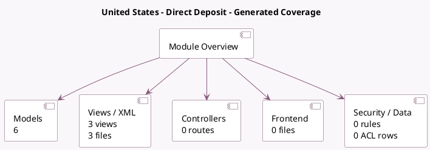

<!-- GENERATED:MODULE -->
---
tags: [odoo, enterprise, module]
---

# United States - Direct Deposit

- Scope: Enterprise Addons
- Source: enterprise/l10n_us_direct_deposit
- Dependencies: [[docs/Enterprise Addons/account_batch_payment/account_batch_payment|account_batch_payment]], [[docs/Community Addons/l10n_us/l10n_us|l10n_us]]

## Summary

Pay Vendors via Wise

## Generated coverage

- Models: 6
- XML files with UI/data artifacts: 3
- Views: 3
- Actions: 0
- Menus: 0
- Rules (ir.rule): 0
- Access CSV entries: 0
- Controller units: 0
- Frontend asset files: 0

## Module map

## Detail notes

- Models: [[docs/Enterprise Addons/l10n_us_direct_deposit/Models|Models]] (6)
- Views and XML: [[docs/Enterprise Addons/l10n_us_direct_deposit/Views|Views]] (3 files)

## Key models

- `account.batch.payment`
- `account.payment`
- `account.payment.method`
- `res.company`
- `res.config.settings`
- `res.partner.bank`

## Navigation

- [[../Enterprise Addons/Enterprise Addons|Back to scope]]
- [[../../docs/docs|Back to docs]]

<!-- GENERATED:MODULE -->

