<!-- GENERATED:MODEL -->
---
tags: [odoo, enterprise, generated, model]
---

# hr.employee

- Module: [[docs/Enterprise Addons/l10n_us_hr_payroll/l10n_us_hr_payroll|l10n_us_hr_payroll]]
- Scope: Enterprise Addons
- Defined in module: extension only
- Source files: `models/hr_employee.py`
- Python classes: `HrEmployee`

## Field footprint

- Detected fields: 31
- Field types: `Boolean` x 5, `Char` x 1, `Float` x 10, `Integer` x 2, `Many2one` x 1, `Monetary` x 7, `Selection` x 5
- Relation fields: 1

## Sample fields

- `l10n_us_commuter_benefits`: `Monetary` (related `version_id.l10n_us_commuter_benefits`)
- `l10n_us_employee_state_code`: `Char` (related `version_id.l10n_us_employee_state_code`)
- `l10n_us_filing_status`: `Selection` (related `version_id.l10n_us_filing_status`)
- `l10n_us_health_benefits_dental`: `Monetary` (related `version_id.l10n_us_health_benefits_dental`)
- `l10n_us_health_benefits_fsa`: `Monetary` (related `version_id.l10n_us_health_benefits_fsa`)
- `l10n_us_health_benefits_fsadc`: `Monetary` (related `version_id.l10n_us_health_benefits_fsadc`)
- `l10n_us_health_benefits_hsa`: `Monetary` (related `version_id.l10n_us_health_benefits_hsa`)
- `l10n_us_health_benefits_medical`: `Monetary` (related `version_id.l10n_us_health_benefits_medical`)
- `l10n_us_health_benefits_vision`: `Monetary` (related `version_id.l10n_us_health_benefits_vision`)
- `l10n_us_old_w4`: `Boolean` (related `version_id.l10n_us_old_w4`)
- `l10n_us_post_roth_401k_amount`: `Float` (related `version_id.l10n_us_post_roth_401k_amount`)
- `l10n_us_post_roth_401k_type`: `Selection` (related `version_id.l10n_us_post_roth_401k_type`)
- `l10n_us_pre_retirement_amount`: `Float` (related `version_id.l10n_us_pre_retirement_amount`)
- `l10n_us_pre_retirement_matching_amount`: `Float` (related `version_id.l10n_us_pre_retirement_matching_amount`)
- `l10n_us_pre_retirement_matching_type`: `Selection` (related `version_id.l10n_us_pre_retirement_matching_type`)
- `l10n_us_pre_retirement_matching_yearly_cap`: `Float` (related `version_id.l10n_us_pre_retirement_matching_yearly_cap`)
- `l10n_us_pre_retirement_type`: `Selection` (related `version_id.l10n_us_pre_retirement_type`)
- `l10n_us_retirement_plan`: `Boolean` (related `version_id.l10n_us_retirement_plan`)
- `l10n_us_state_extra_withholding`: `Float` (related `version_id.l10n_us_state_extra_withholding`)
- `l10n_us_state_filing_status`: `Selection` (related `version_id.l10n_us_state_filing_status`)

## Method hints

- Detected methods: 0
- Action methods: none
- Compute methods: none
- Onchange methods: none

## Direct relation diagram

```plantuml
@startuml
!define ODOO_COLOR_PRIMARY #714B67
!define ODOO_COLOR_ACCENT #875A7B
!define ODOO_COLOR_BG #FAF7FA

skinparam backgroundColor ODOO_COLOR_BG
skinparam defaultTextAlignment left
skinparam ArrowColor ODOO_COLOR_ACCENT
skinparam ClassBackgroundColor white
skinparam ClassBorderColor ODOO_COLOR_PRIMARY
skinparam ComponentBackgroundColor white
skinparam ComponentBorderColor ODOO_COLOR_PRIMARY
skinparam NoteBackgroundColor #FFF8FF
skinparam NoteBorderColor ODOO_COLOR_ACCENT
skinparam SequenceLifeLineBorderColor ODOO_COLOR_ACCENT
skinparam SequenceLifeLineBackgroundColor #FFFFFF
skinparam SequenceParticipantBorderColor ODOO_COLOR_PRIMARY
skinparam SequenceParticipantBackgroundColor #FFFFFF
skinparam sequence {
  ArrowColor ODOO_COLOR_ACCENT
  ActorBorderColor ODOO_COLOR_PRIMARY
}
title hr.employee - Direct Relations
class "hr.employee" as hr_employee
@enduml
```

## Navigation

- **Parent:** [[docs/Enterprise Addons/l10n_us_hr_payroll/Models]]

<!-- GENERATED:MODEL -->
