<!-- GENERATED:MODEL -->
---
tags: [odoo, enterprise, generated, model]
---

# hr.version

- Module: [[docs/Enterprise Addons/l10n_us_hr_payroll/l10n_us_hr_payroll|l10n_us_hr_payroll]]
- Scope: Enterprise Addons
- Defined in module: extension only
- Source files: `models/hr_version.py`
- Python classes: `HrVersion`

## Field footprint

- Detected fields: 31
- Field types: `Boolean` x 5, `Char` x 1, `Float` x 10, `Integer` x 2, `Many2one` x 1, `Monetary` x 7, `Selection` x 5
- Relation fields: 1

## Sample fields

- `l10n_us_commuter_benefits`: `Monetary`
- `l10n_us_employee_state_code`: `Char` (related `address_id.state_id.code`)
- `l10n_us_filing_status`: `Selection`
- `l10n_us_health_benefits_dental`: `Monetary`
- `l10n_us_health_benefits_fsa`: `Monetary`
- `l10n_us_health_benefits_fsadc`: `Monetary`
- `l10n_us_health_benefits_hsa`: `Monetary`
- `l10n_us_health_benefits_medical`: `Monetary`
- `l10n_us_health_benefits_vision`: `Monetary`
- `l10n_us_old_w4`: `Boolean`
- `l10n_us_post_roth_401k_amount`: `Float`
- `l10n_us_post_roth_401k_type`: `Selection`
- `l10n_us_pre_retirement_amount`: `Float`
- `l10n_us_pre_retirement_matching_amount`: `Float`
- `l10n_us_pre_retirement_matching_type`: `Selection`
- `l10n_us_pre_retirement_matching_yearly_cap`: `Float`
- `l10n_us_pre_retirement_type`: `Selection`
- `l10n_us_retirement_plan`: `Boolean`
- `l10n_us_state_extra_withholding`: `Float`
- `l10n_us_state_filing_status`: `Selection`

## Method hints

- Detected methods: 4
- Action methods: none
- Compute methods: none
- Onchange methods: none

## Direct relation diagram

```plantuml
@startuml
!define ODOO_COLOR_PRIMARY #714B67
!define ODOO_COLOR_ACCENT #875A7B
!define ODOO_COLOR_BG #FAF7FA

skinparam backgroundColor ODOO_COLOR_BG
skinparam defaultTextAlignment left
skinparam ArrowColor ODOO_COLOR_ACCENT
skinparam ClassBackgroundColor white
skinparam ClassBorderColor ODOO_COLOR_PRIMARY
skinparam ComponentBackgroundColor white
skinparam ComponentBorderColor ODOO_COLOR_PRIMARY
skinparam NoteBackgroundColor #FFF8FF
skinparam NoteBorderColor ODOO_COLOR_ACCENT
skinparam SequenceLifeLineBorderColor ODOO_COLOR_ACCENT
skinparam SequenceLifeLineBackgroundColor #FFFFFF
skinparam SequenceParticipantBorderColor ODOO_COLOR_PRIMARY
skinparam SequenceParticipantBackgroundColor #FFFFFF
skinparam sequence {
  ArrowColor ODOO_COLOR_ACCENT
  ActorBorderColor ODOO_COLOR_PRIMARY
}
title hr.version - Direct Relations
class "hr.version" as hr_version
class "l10n.us.worker.compensation" as l10n_us_worker_compensation
hr_version --> l10n_us_worker_compensation : l10n_us_worker_compensation_id
@enduml
```

## Navigation

- **Parent:** [[docs/Enterprise Addons/l10n_us_hr_payroll/Models]]

<!-- GENERATED:MODEL -->
