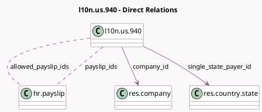

<!-- GENERATED:MODEL -->
---
tags: [odoo, enterprise, generated, model]
---

# l10n.us.940

- Module: [[docs/Enterprise Addons/l10n_us_hr_payroll/l10n_us_hr_payroll|l10n_us_hr_payroll]]
- Scope: Enterprise Addons
- Defined in module: yes
- Source files: `models/l10n_us_940.py`
- Python classes: `L10nUsForm940`
- Description: Form 940

## Field footprint

- Detected fields: 10
- Field types: `Binary` x 1, `Boolean` x 2, `Char` x 2, `Many2many` x 2, `Many2one` x 2, `Selection` x 1
- Relation fields: 4

## Sample fields

- `allowed_payslip_ids`: `Many2many` (comodel `hr.payslip`, compute `_compute_allowed_payslip_ids`)
- `company_id`: `Many2one` (comodel `res.company`)
- `csv_file`: `Binary` (comodel `CSV file`)
- `csv_filename`: `Char`
- `has_paid_credit_reduction_state`: `Boolean` (comodel `Paid in Credit Reduction State`)
- `irs_payment_option`: `Selection`
- `is_multi_state_employer`: `Boolean` (comodel `Multi State Employer`)
- `payslip_ids`: `Many2many` (comodel `hr.payslip`, compute `_compute_payslips_ids`, store `True`)
- `single_state_payer_id`: `Many2one` (comodel `res.country.state`)
- `year`: `Char`

## Method hints

- Detected methods: 6
- Action methods: `action_generate_csv`
- Compute methods: `_compute_allowed_payslip_ids`, `_compute_display_name`, `_compute_payslips_ids`
- Onchange methods: none

## Direct relation diagram

## Navigation

- **Parent:** [[docs/Enterprise Addons/l10n_us_hr_payroll/Models]]

<!-- GENERATED:MODEL -->
