<!-- GENERATED:MODEL -->
---
tags: [odoo, enterprise, generated, model]
---

# l10n.us.941

- Module: [[docs/Enterprise Addons/l10n_us_hr_payroll/l10n_us_hr_payroll|l10n_us_hr_payroll]]
- Scope: Enterprise Addons
- Defined in module: yes
- Source files: `models/l10n_us_941.py`
- Python classes: `L10nUsForm941`
- Description: Form 941

## Field footprint

- Detected fields: 9
- Field types: `Binary` x 1, `Char` x 2, `Many2many` x 2, `Many2one` x 1, `Selection` x 3
- Relation fields: 3

## Sample fields

- `allowed_payslip_ids`: `Many2many` (comodel `hr.payslip`, compute `_compute_allowed_payslip_ids`)
- `company_id`: `Many2one` (comodel `res.company`)
- `csv_file`: `Binary` (comodel `CSV file`)
- `csv_filename`: `Char`
- `irs_payment_option`: `Selection`
- `payslip_ids`: `Many2many` (comodel `hr.payslip`, compute `_compute_payslips_ids`, store `True`)
- `quarter`: `Selection`
- `tax_liability`: `Selection`
- `year`: `Char`

## Method hints

- Detected methods: 8
- Action methods: `action_generate_csv`
- Compute methods: `_compute_allowed_payslip_ids`, `_compute_display_name`, `_compute_payslips_ids`
- Onchange methods: none

## Direct relation diagram

```plantuml
@startuml
!define ODOO_COLOR_PRIMARY #714B67
!define ODOO_COLOR_ACCENT #875A7B
!define ODOO_COLOR_BG #FAF7FA

skinparam backgroundColor ODOO_COLOR_BG
skinparam defaultTextAlignment left
skinparam ArrowColor ODOO_COLOR_ACCENT
skinparam ClassBackgroundColor white
skinparam ClassBorderColor ODOO_COLOR_PRIMARY
skinparam ComponentBackgroundColor white
skinparam ComponentBorderColor ODOO_COLOR_PRIMARY
skinparam NoteBackgroundColor #FFF8FF
skinparam NoteBorderColor ODOO_COLOR_ACCENT
skinparam SequenceLifeLineBorderColor ODOO_COLOR_ACCENT
skinparam SequenceLifeLineBackgroundColor #FFFFFF
skinparam SequenceParticipantBorderColor ODOO_COLOR_PRIMARY
skinparam SequenceParticipantBackgroundColor #FFFFFF
skinparam sequence {
  ArrowColor ODOO_COLOR_ACCENT
  ActorBorderColor ODOO_COLOR_PRIMARY
}
title l10n.us.941 - Direct Relations
class "l10n.us.941" as l10n_us_941
class "hr.payslip" as hr_payslip
class "res.company" as res_company
l10n_us_941 --> res_company : company_id
l10n_us_941 .. hr_payslip : allowed_payslip_ids
l10n_us_941 .. hr_payslip : payslip_ids
@enduml
```

## Navigation

- **Parent:** [[docs/Enterprise Addons/l10n_us_hr_payroll/Models]]

<!-- GENERATED:MODEL -->
