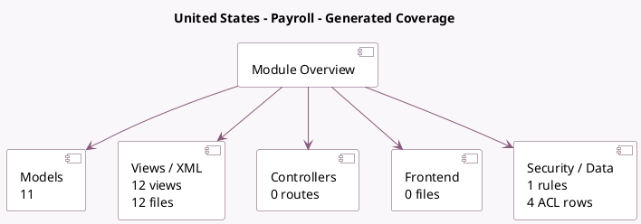

<!-- GENERATED:MODULE -->
---
tags: [odoo, enterprise, module]
---

# United States - Payroll

- Scope: Enterprise Addons
- Source: enterprise/l10n_us_hr_payroll
- Dependencies: [[docs/Enterprise Addons/hr_payroll/hr_payroll|hr_payroll]], [[docs/Community Addons/hr_work_entry_holidays/hr_work_entry_holidays|hr_work_entry_holidays]], [[docs/Enterprise Addons/hr_payroll_holidays/hr_payroll_holidays|hr_payroll_holidays]], [[docs/Community Addons/base_address_extended/base_address_extended|base_address_extended]], [[docs/Community Addons/l10n_us/l10n_us|l10n_us]]

## Generated coverage

- Models: 11
- XML files with UI/data artifacts: 12
- Views: 12
- Actions: 6
- Menus: 5
- Rules (ir.rule): 1
- Access CSV entries: 4
- Controller units: 0
- Frontend asset files: 0

## Module map

## Detail notes

- Models: [[docs/Enterprise Addons/l10n_us_hr_payroll/Models|Models]] (11)
- Views and XML: [[docs/Enterprise Addons/l10n_us_hr_payroll/Views|Views]] (12 files)

## Key models

- `hr.employee`
- `hr.leave.allocation`
- `hr.leave.type`
- `hr.payslip`
- `hr.version`
- `l10n.us.940`
- `l10n.us.941`
- `l10n.us.w2`
- `l10n.us.worker.compensation`
- `res.company`
- `res.config.settings`

## Navigation

- [[../Enterprise Addons/Enterprise Addons|Back to scope]]
- [[../../docs/docs|Back to docs]]

<!-- GENERATED:MODULE -->

