<!-- GENERATED:MODEL -->
---
tags: [odoo, enterprise, generated, model]
---

# l10n.us.adp.export

- Module: [[docs/Enterprise Addons/l10n_us_hr_payroll_adp/l10n_us_hr_payroll_adp|l10n_us_hr_payroll_adp]]
- Scope: Enterprise Addons
- Defined in module: yes
- Source files: `models/l10n_us_adp_export.py`
- Python classes: `L10nUsAdpExport`
- Description: ADP Export

## Field footprint

- Detected fields: 11
- Field types: `Binary` x 1, `Char` x 5, `Date` x 2, `Many2many` x 2, `Many2one` x 1
- Relation fields: 3

## Sample fields

- `batch_description`: `Char` (comodel `Batch Description`)
- `batch_id`: `Char` (comodel `Batch ID`)
- `company_id`: `Many2one` (comodel `res.company`)
- `csv_file`: `Binary` (comodel `CSV file`)
- `csv_filename`: `Char`
- `employee_ids`: `Many2many` (comodel `hr.employee`)
- `end_date`: `Date` (comodel `End Date`)
- `name`: `Char` (compute `_compute_name`)
- `start_date`: `Date` (comodel `Start Date`)
- `warning_message`: `Char` (compute `_compute_warning_message`)
- `work_entry_ids`: `Many2many` (comodel `hr.work.entry`, compute `_compute_work_entry_ids`)

## Method hints

- Detected methods: 10
- Action methods: `action_generate_csv`, `action_open_work_entries`
- Compute methods: `_compute_name`, `_compute_warning_message`, `_compute_work_entry_ids`
- Onchange methods: none

## Direct relation diagram

```plantuml
@startuml
!define ODOO_COLOR_PRIMARY #714B67
!define ODOO_COLOR_ACCENT #875A7B
!define ODOO_COLOR_BG #FAF7FA

skinparam backgroundColor ODOO_COLOR_BG
skinparam defaultTextAlignment left
skinparam ArrowColor ODOO_COLOR_ACCENT
skinparam ClassBackgroundColor white
skinparam ClassBorderColor ODOO_COLOR_PRIMARY
skinparam ComponentBackgroundColor white
skinparam ComponentBorderColor ODOO_COLOR_PRIMARY
skinparam NoteBackgroundColor #FFF8FF
skinparam NoteBorderColor ODOO_COLOR_ACCENT
skinparam SequenceLifeLineBorderColor ODOO_COLOR_ACCENT
skinparam SequenceLifeLineBackgroundColor #FFFFFF
skinparam SequenceParticipantBorderColor ODOO_COLOR_PRIMARY
skinparam SequenceParticipantBackgroundColor #FFFFFF
skinparam sequence {
  ArrowColor ODOO_COLOR_ACCENT
  ActorBorderColor ODOO_COLOR_PRIMARY
}
title l10n.us.adp.export - Direct Relations
class "l10n.us.adp.export" as l10n_us_adp_export
class "hr.employee" as hr_employee
class "hr.work.entry" as hr_work_entry
class "res.company" as res_company
l10n_us_adp_export --> res_company : company_id
l10n_us_adp_export .. hr_employee : employee_ids
l10n_us_adp_export .. hr_work_entry : work_entry_ids
@enduml
```

## Navigation

- **Parent:** [[docs/Enterprise Addons/l10n_us_hr_payroll_adp/Models]]

<!-- GENERATED:MODEL -->
