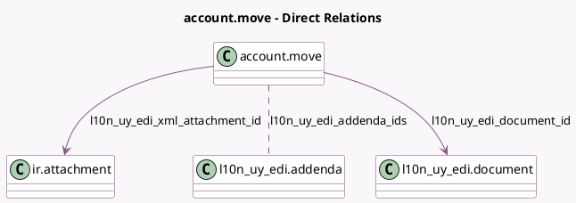

<!-- GENERATED:MODEL -->
---
tags: [odoo, enterprise, generated, model]
---

# account.move

- Module: [[docs/Enterprise Addons/l10n_uy_edi/l10n_uy_edi|l10n_uy_edi]]
- Scope: Enterprise Addons
- Defined in module: extension only
- Source files: `models/account_move.py`
- Python classes: `AccountMove`

## Field footprint

- Detected fields: 10
- Field types: `Boolean` x 1, `Char` x 1, `Many2many` x 1, `Many2one` x 2, `Selection` x 4, `Text` x 1
- Relation fields: 3

## Sample fields

- `l10n_uy_edi_addenda_ids`: `Many2many` (comodel `l10n_uy_edi.addenda`)
- `l10n_uy_edi_cfe_sale_mode`: `Selection`
- `l10n_uy_edi_cfe_state`: `Selection` (related `l10n_uy_edi_document_id.state`, store `True`)
- `l10n_uy_edi_cfe_transport_route`: `Selection`
- `l10n_uy_edi_cfe_uuid`: `Char` (related `l10n_uy_edi_document_id.uuid`)
- `l10n_uy_edi_document_id`: `Many2one` (comodel `l10n_uy_edi.document`)
- `l10n_uy_edi_error`: `Text` (related `l10n_uy_edi_document_id.message`)
- `l10n_uy_edi_is_needed`: `Boolean` (compute `_compute_l10n_uy_edi_is_needed`)
- `l10n_uy_edi_journal_type`: `Selection` (related `journal_id.l10n_uy_edi_type`)
- `l10n_uy_edi_xml_attachment_id`: `Many2one` (comodel `ir.attachment`, compute `_compute_l10n_uy_edi_xml_attachment_id`)

## Method hints

- Detected methods: 44
- Action methods: `action_post`
- Compute methods: `_compute_l10n_latam_document_type`, `_compute_l10n_uy_edi_is_needed`, `_compute_l10n_uy_edi_xml_attachment_id`, `_compute_name`, `_compute_show_reset_to_draft_button`
- Onchange methods: none

## Direct relation diagram

## Navigation

- **Parent:** [[docs/Enterprise Addons/l10n_uy_edi/Models]]

<!-- GENERATED:MODEL -->
