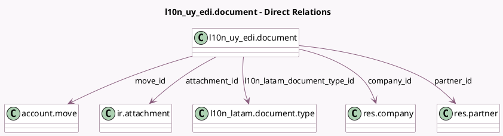

<!-- GENERATED:MODEL -->
---
tags: [odoo, enterprise, generated, model]
---

# l10n_uy_edi.document

- Module: [[docs/Enterprise Addons/l10n_uy_edi/l10n_uy_edi|l10n_uy_edi]]
- Scope: Enterprise Addons
- Defined in module: yes
- Source files: `models/l10n_uy_edi_document.py`
- Python classes: `L10n_Uy_EdiDocument`
- Description: Electronic Fiscal Document (CFE - UY)

## Field footprint

- Detected fields: 11
- Field types: `Binary` x 1, `Char` x 2, `Datetime` x 1, `Many2one` x 5, `Selection` x 1, `Text` x 1
- Relation fields: 5

## Sample fields

- `attachment_file`: `Binary`
- `attachment_id`: `Many2one` (comodel `ir.attachment`)
- `company_id`: `Many2one` (comodel `res.company`, compute `_compute_from_origin`)
- `l10n_latam_document_number`: `Char` (compute `_compute_from_origin`)
- `l10n_latam_document_type_id`: `Many2one` (comodel `l10n_latam.document.type`, compute `_compute_from_origin`)
- `message`: `Text`
- `move_id`: `Many2one` (comodel `account.move`)
- `partner_id`: `Many2one` (comodel `res.partner`, compute `_compute_from_origin`)
- `request_datetime`: `Datetime`
- `state`: `Selection`
- `uuid`: `Char`

## Method hints

- Detected methods: 36
- Action methods: `action_download_file`, `action_update_dgi_state`
- Compute methods: `_compute_from_origin`, `_compute_linked_attachment_id`
- Onchange methods: none

## Direct relation diagram

## Navigation

- **Parent:** [[docs/Enterprise Addons/l10n_uy_edi/Models]]

<!-- GENERATED:MODEL -->
