<!-- GENERATED:MODEL -->
---
tags: [odoo, enterprise, generated, model]
---

# l10n_uy_edi.document

- Module: [[docs/Enterprise Addons/l10n_uy_edi_stock/l10n_uy_edi_stock|l10n_uy_edi_stock]]
- Scope: Enterprise Addons
- Defined in module: extension only
- Source files: `models/l10n_uy_edi_document.py`
- Python classes: `L10nUyEdiDocument`

## Field footprint

- Detected fields: 1
- Field types: `Many2one` x 1
- Relation fields: 1

## Sample fields

- `picking_id`: `Many2one` (comodel `stock.picking`)

## Method hints

- Detected methods: 7
- Action methods: `action_update_dgi_state`
- Compute methods: `_compute_display_name`, `_compute_from_origin`
- Onchange methods: none

## Direct relation diagram

```plantuml
@startuml
!define ODOO_COLOR_PRIMARY #714B67
!define ODOO_COLOR_ACCENT #875A7B
!define ODOO_COLOR_BG #FAF7FA

skinparam backgroundColor ODOO_COLOR_BG
skinparam defaultTextAlignment left
skinparam ArrowColor ODOO_COLOR_ACCENT
skinparam ClassBackgroundColor white
skinparam ClassBorderColor ODOO_COLOR_PRIMARY
skinparam ComponentBackgroundColor white
skinparam ComponentBorderColor ODOO_COLOR_PRIMARY
skinparam NoteBackgroundColor #FFF8FF
skinparam NoteBorderColor ODOO_COLOR_ACCENT
skinparam SequenceLifeLineBorderColor ODOO_COLOR_ACCENT
skinparam SequenceLifeLineBackgroundColor #FFFFFF
skinparam SequenceParticipantBorderColor ODOO_COLOR_PRIMARY
skinparam SequenceParticipantBackgroundColor #FFFFFF
skinparam sequence {
  ArrowColor ODOO_COLOR_ACCENT
  ActorBorderColor ODOO_COLOR_PRIMARY
}
title l10n_uy_edi.document - Direct Relations
class "l10n_uy_edi.document" as l10n_uy_edi_document
class "stock.picking" as stock_picking
l10n_uy_edi_document --> stock_picking : picking_id
@enduml
```

## Navigation

- **Parent:** [[docs/Enterprise Addons/l10n_uy_edi_stock/Models]]

<!-- GENERATED:MODEL -->
