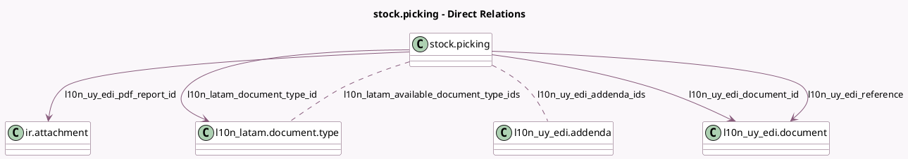

<!-- GENERATED:MODEL -->
---
tags: [odoo, enterprise, generated, model]
---

# stock.picking

- Module: [[docs/Enterprise Addons/l10n_uy_edi_stock/l10n_uy_edi_stock|l10n_uy_edi_stock]]
- Scope: Enterprise Addons
- Defined in module: extension only
- Source files: `models/stock_picking.py`
- Python classes: `StockPicking`
- Description: Stock Picking - Delivery Guide (Uruguay)

## Field footprint

- Detected fields: 13
- Field types: `Binary` x 1, `Boolean` x 1, `Char` x 2, `Many2many` x 2, `Many2one` x 4, `Selection` x 2, `Text` x 1
- Relation fields: 6

## Sample fields

- `l10n_latam_available_document_type_ids`: `Many2many` (comodel `l10n_latam.document.type`, compute `_compute_l10n_latam_available_document_types`)
- `l10n_latam_document_number`: `Char`
- `l10n_latam_document_type_id`: `Many2one` (comodel `l10n_latam.document.type`, compute `_compute_l10n_latam_document_type_id`, store `True`)
- `l10n_uy_edi_addenda_ids`: `Many2many` (comodel `l10n_uy_edi.addenda`)
- `l10n_uy_edi_cfe_state`: `Selection` (related `l10n_uy_edi_document_id.state`, store `True`)
- `l10n_uy_edi_cfe_uuid`: `Char` (related `l10n_uy_edi_document_id.uuid`)
- `l10n_uy_edi_document_id`: `Many2one` (comodel `l10n_uy_edi.document`)
- `l10n_uy_edi_error`: `Text` (related `l10n_uy_edi_document_id.message`)
- `l10n_uy_edi_operation_type`: `Selection` (store `True`)
- `l10n_uy_edi_pdf_report_file`: `Binary`
- `l10n_uy_edi_pdf_report_id`: `Many2one` (comodel `ir.attachment`)
- `l10n_uy_edi_reference`: `Many2one` (comodel `l10n_uy_edi.document`)
- `l10n_uy_is_cfe`: `Boolean` (compute `_compute_l10n_uy_is_cfe`)

## Method hints

- Detected methods: 26
- Action methods: `action_cancel`
- Compute methods: `_compute_display_name`, `_compute_l10n_latam_available_document_types`, `_compute_l10n_latam_document_type_id`, `_compute_l10n_uy_is_cfe`, `_compute_linked_attachment_id`
- Onchange methods: none

## Direct relation diagram

## Navigation

- **Parent:** [[docs/Enterprise Addons/l10n_uy_edi_stock/Models]]

<!-- GENERATED:MODEL -->
