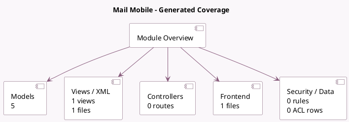

<!-- GENERATED:MODULE -->
---
tags: [odoo, enterprise, module]
---

# Mail Mobile

- Scope: Enterprise Addons
- Source: enterprise/mail_mobile
- Dependencies: [[docs/Community Addons/iap_mail/iap_mail|iap_mail]], [[docs/Enterprise Addons/mail_enterprise/mail_enterprise|mail_enterprise]], [[docs/Enterprise Addons/web_mobile/web_mobile|web_mobile]], [[docs/Community Addons/base_setup/base_setup|base_setup]]

## Summary

Provides push notification and redirection to the mobile app.

## Generated coverage

- Models: 5
- XML files with UI/data artifacts: 1
- Views: 1
- Actions: 0
- Menus: 0
- Rules (ir.rule): 0
- Access CSV entries: 0
- Controller units: 0
- Frontend asset files: 1

## Module map

## Detail notes

- Models: [[docs/Enterprise Addons/mail_mobile/Models|Models]] (5)
- Views and XML: [[docs/Enterprise Addons/mail_mobile/Views|Views]] (1 files)
- Frontend: [[docs/Enterprise Addons/mail_mobile/Frontend|Frontend]] (1 files)

## Key models

- `discuss.channel`
- `ir.http`
- `mail.thread`
- `res.config.settings`
- `res.partner`

## Navigation

- [[../Enterprise Addons/Enterprise Addons|Back to scope]]
- [[../../docs/docs|Back to docs]]

<!-- GENERATED:MODULE -->

