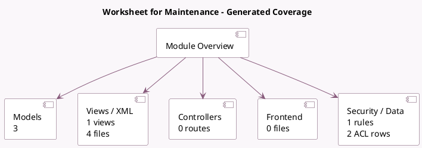

<!-- GENERATED:MODULE -->
---
tags: [odoo, enterprise, module]
---

# Worksheet for Maintenance

- Scope: Enterprise Addons
- Source: enterprise/maintenance_worksheet
- Dependencies: [[docs/Community Addons/maintenance/maintenance|maintenance]], [[docs/Enterprise Addons/worksheet/worksheet|worksheet]]

## Summary

Create custom worksheets for Maintenance

## Generated coverage

- Models: 3
- XML files with UI/data artifacts: 4
- Views: 1
- Actions: 3
- Menus: 1
- Rules (ir.rule): 1
- Access CSV entries: 2
- Controller units: 0
- Frontend asset files: 0

## Module map

## Detail notes

- Models: [[docs/Enterprise Addons/maintenance_worksheet/Models|Models]] (3)
- Views and XML: [[docs/Enterprise Addons/maintenance_worksheet/Views|Views]] (4 files)

## Key models

- `maintenance.request`
- `report.maintenance_worksheet.maintenance_worksheet`
- `worksheet.template`

## Navigation

- [[../Enterprise Addons/Enterprise Addons|Back to scope]]
- [[../../docs/docs|Back to docs]]

<!-- GENERATED:MODULE -->

