<!-- GENERATED:MODEL -->
---
tags: [odoo, enterprise, generated, model]
---

# mailing.mailing

- Module: [[docs/Enterprise Addons/marketing_automation/marketing_automation|marketing_automation]]
- Scope: Enterprise Addons
- Defined in module: extension only
- Source files: `models/mailing_mailing.py`
- Python classes: `MailingMailing`

## Field footprint

- Detected fields: 2
- Field types: `Boolean` x 1, `One2many` x 1
- Relation fields: 1

## Sample fields

- `marketing_activity_ids`: `One2many` (comodel `marketing.activity`)
- `use_in_marketing_automation`: `Boolean`

## Method hints

- Detected methods: 5
- Action methods: none
- Compute methods: none
- Onchange methods: none

## Direct relation diagram

```plantuml
@startuml
!define ODOO_COLOR_PRIMARY #714B67
!define ODOO_COLOR_ACCENT #875A7B
!define ODOO_COLOR_BG #FAF7FA

skinparam backgroundColor ODOO_COLOR_BG
skinparam defaultTextAlignment left
skinparam ArrowColor ODOO_COLOR_ACCENT
skinparam ClassBackgroundColor white
skinparam ClassBorderColor ODOO_COLOR_PRIMARY
skinparam ComponentBackgroundColor white
skinparam ComponentBorderColor ODOO_COLOR_PRIMARY
skinparam NoteBackgroundColor #FFF8FF
skinparam NoteBorderColor ODOO_COLOR_ACCENT
skinparam SequenceLifeLineBorderColor ODOO_COLOR_ACCENT
skinparam SequenceLifeLineBackgroundColor #FFFFFF
skinparam SequenceParticipantBorderColor ODOO_COLOR_PRIMARY
skinparam SequenceParticipantBackgroundColor #FFFFFF
skinparam sequence {
  ArrowColor ODOO_COLOR_ACCENT
  ActorBorderColor ODOO_COLOR_PRIMARY
}
title mailing.mailing - Direct Relations
class "mailing.mailing" as mailing_mailing
class "marketing.activity" as marketing_activity
mailing_mailing --|> marketing_activity : marketing_activity_ids
@enduml
```

## Navigation

- **Parent:** [[docs/Enterprise Addons/marketing_automation/Models]]

<!-- GENERATED:MODEL -->
