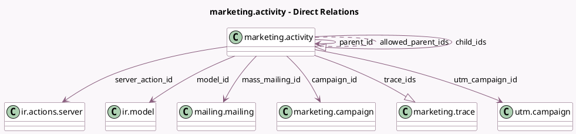

<!-- GENERATED:MODEL -->
---
tags: [odoo, enterprise, generated, model]
---

# marketing.activity

- Module: [[docs/Enterprise Addons/marketing_automation/marketing_automation|marketing_automation]]
- Scope: Enterprise Addons
- Defined in module: yes
- Source files: `models/marketing_activity.py`
- Python classes: `MarketingActivity`
- Description: Marketing Activity
- Inherits: `utm.source.mixin`

## Field footprint

- Detected fields: 32
- Field types: `Boolean` x 2, `Char` x 4, `Html` x 1, `Integer` x 10, `Many2many` x 1, `Many2one` x 6, `One2many` x 2, `Selection` x 6
- Relation fields: 9

## Sample fields

- `activity_domain`: `Char`
- `activity_summary`: `Html` (compute `_compute_activity_summary`)
- `activity_type`: `Selection`
- `allowed_parent_ids`: `Many2many` (comodel `marketing.activity`, compute `_compute_allowed_parent_ids`)
- `campaign_id`: `Many2one` (comodel `marketing.campaign`)
- `child_ids`: `One2many` (comodel `marketing.activity`)
- `domain`: `Char` (compute `_compute_inherited_domain`, store `True`)
- `interval_number`: `Integer`
- `interval_standardized`: `Integer` (comodel `Send after (in hours)`, compute `_compute_interval_standardized`, store `True`)
- `interval_type`: `Selection`
- `mass_mailing_id`: `Many2one` (comodel `mailing.mailing`, compute `_compute_mass_mailing_id`, store `True`)
- `mass_mailing_id_mailing_type`: `Selection` (compute `_compute_mass_mailing_id_mailing_type`, store `True`)
- `model_id`: `Many2one` (comodel `ir.model`, related `campaign_id.model_id`)
- `model_name`: `Char` (related `model_id.model`)
- `parent_id`: `Many2one` (comodel `marketing.activity`, compute `_compute_parent_id`, store `True`)
- `processed`: `Integer` (compute `_compute_statistics`)
- `rejected`: `Integer` (compute `_compute_statistics`)
- `require_sync`: `Boolean` (comodel `Require trace sync`)
- `server_action_id`: `Many2one` (comodel `ir.actions.server`, compute `_compute_server_action_id`, store `True`)
- `statistics_graph_data`: `Char` (compute `_compute_statistics_graph_data`)

## Method hints

- Detected methods: 30
- Action methods: `action_view_clicked`, `action_view_opened`, `action_view_replied`, `action_view_sent`
- Compute methods: `_compute_activity_summary`, `_compute_allowed_parent_ids`, `_compute_inherited_domain`, `_compute_interval_standardized`, `_compute_mass_mailing_id`, `_compute_mass_mailing_id_mailing_type`, `_compute_parent_id`, `_compute_server_action_id`, and 3 more
- Onchange methods: none

## Direct relation diagram

## Navigation

- **Parent:** [[docs/Enterprise Addons/marketing_automation/Models]]

<!-- GENERATED:MODEL -->
