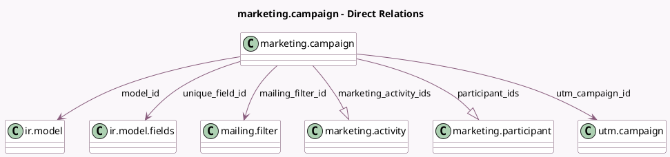

<!-- GENERATED:MODEL -->
---
tags: [odoo, enterprise, generated, model]
---

# marketing.campaign

- Module: [[docs/Enterprise Addons/marketing_automation/marketing_automation|marketing_automation]]
- Scope: Enterprise Addons
- Defined in module: yes
- Source files: `models/marketing_campaign.py`
- Python classes: `MarketingCampaign`
- Description: Marketing Campaign

## Field footprint

- Detected fields: 20
- Field types: `Boolean` x 2, `Char` x 3, `Datetime` x 1, `Integer` x 7, `Many2one` x 4, `One2many` x 2, `Selection` x 1
- Relation fields: 6

## Sample fields

- `active`: `Boolean`
- `completed_participant_count`: `Integer` (compute `_compute_participants`)
- `domain`: `Char` (compute `_compute_domain`, store `True`)
- `last_sync_date`: `Datetime`
- `link_tracker_click_count`: `Integer` (comodel `# Clicks`, compute `_compute_link_tracker_click_count`)
- `mailing_filter_count`: `Integer` (comodel `# Favorite Filters`, compute `_compute_mailing_filter_count`)
- `mailing_filter_domain`: `Char` (comodel `Favorite filter domain`, related `mailing_filter_id.mailing_domain`)
- `mailing_filter_id`: `Many2one` (comodel `mailing.filter`, compute `_compute_mailing_filter_id`, store `True`)
- `marketing_activity_ids`: `One2many` (comodel `marketing.activity`)
- `mass_mailing_count`: `Integer` (comodel `# Mailings`, compute `_compute_mass_mailing_count`)
- `model_id`: `Many2one` (comodel `ir.model`)
- `model_name`: `Char` (related `model_id.model`, store `True`)
- `participant_ids`: `One2many` (comodel `marketing.participant`)
- `require_sync`: `Boolean` (compute `_compute_require_sync`)
- `running_participant_count`: `Integer` (compute `_compute_participants`)
- `state`: `Selection`
- `test_participant_count`: `Integer` (compute `_compute_participants`)
- `total_participant_count`: `Integer` (compute `_compute_participants`)
- `unique_field_id`: `Many2one` (comodel `ir.model.fields`, compute `_compute_unique_field_id`, store `True`)
- `utm_campaign_id`: `Many2one` (comodel `utm.campaign`)

## Method hints

- Detected methods: 35
- Action methods: `action_set_synchronized`, `action_start_campaign`, `action_stop_campaign`, `action_update_participants`, `action_view_mailings`, `action_view_tracker_statistics`
- Compute methods: `_compute_domain`, `_compute_link_tracker_click_count`, `_compute_mailing_filter_count`, `_compute_mailing_filter_id`, `_compute_mass_mailing_count`, `_compute_participants`, `_compute_require_sync`, `_compute_unique_field_id`
- Onchange methods: `_onchange_model_id`

## Direct relation diagram

## Navigation

- **Parent:** [[docs/Enterprise Addons/marketing_automation/Models]]

<!-- GENERATED:MODEL -->
