<!-- GENERATED:MODEL -->
---
tags: [odoo, enterprise, generated, model]
---

# marketing.campaign.test

- Module: [[docs/Enterprise Addons/marketing_automation/marketing_automation|marketing_automation]]
- Scope: Enterprise Addons
- Defined in module: yes
- Source files: `wizard/marketing_campaign_test.py`
- Python classes: `MarketingCampaignTest`
- Description: Marketing Campaign: Launch a Test

## Field footprint

- Detected fields: 5
- Field types: `Char` x 1, `Integer` x 1, `Many2one` x 2, `Reference` x 1
- Relation fields: 2

## Sample fields

- `campaign_id`: `Many2one` (comodel `marketing.campaign`)
- `model_id`: `Many2one` (comodel `ir.model`, related `campaign_id.model_id`)
- `model_name`: `Char` (comodel `Record model`, related `campaign_id.model_id.model`)
- `res_id`: `Integer`
- `resource_ref`: `Reference` (compute `_compute_resource_ref`)

## Method hints

- Detected methods: 5
- Action methods: `action_launch_test`
- Compute methods: `_compute_resource_ref`
- Onchange methods: none

## Direct relation diagram

```plantuml
@startuml
!define ODOO_COLOR_PRIMARY #714B67
!define ODOO_COLOR_ACCENT #875A7B
!define ODOO_COLOR_BG #FAF7FA

skinparam backgroundColor ODOO_COLOR_BG
skinparam defaultTextAlignment left
skinparam ArrowColor ODOO_COLOR_ACCENT
skinparam ClassBackgroundColor white
skinparam ClassBorderColor ODOO_COLOR_PRIMARY
skinparam ComponentBackgroundColor white
skinparam ComponentBorderColor ODOO_COLOR_PRIMARY
skinparam NoteBackgroundColor #FFF8FF
skinparam NoteBorderColor ODOO_COLOR_ACCENT
skinparam SequenceLifeLineBorderColor ODOO_COLOR_ACCENT
skinparam SequenceLifeLineBackgroundColor #FFFFFF
skinparam SequenceParticipantBorderColor ODOO_COLOR_PRIMARY
skinparam SequenceParticipantBackgroundColor #FFFFFF
skinparam sequence {
  ArrowColor ODOO_COLOR_ACCENT
  ActorBorderColor ODOO_COLOR_PRIMARY
}
title marketing.campaign.test - Direct Relations
class "marketing.campaign.test" as marketing_campaign_test
class "ir.model" as ir_model
class "marketing.campaign" as marketing_campaign
marketing_campaign_test --> marketing_campaign : campaign_id
marketing_campaign_test --> ir_model : model_id
@enduml
```

## Navigation

- **Parent:** [[docs/Enterprise Addons/marketing_automation/Models]]

<!-- GENERATED:MODEL -->
