<!-- GENERATED:MODEL -->
---
tags: [odoo, enterprise, generated, model]
---

# marketing.trace

- Module: [[docs/Enterprise Addons/marketing_automation/marketing_automation|marketing_automation]]
- Scope: Enterprise Addons
- Defined in module: yes
- Source files: `models/marketing_trace.py`
- Python classes: `MarketingTrace`
- Description: Marketing Trace

## Field footprint

- Detected fields: 14
- Field types: `Boolean` x 1, `Char` x 1, `Datetime` x 2, `Integer` x 1, `Many2one` x 3, `One2many` x 2, `Selection` x 4
- Relation fields: 5

## Sample fields

- `activity_id`: `Many2one` (comodel `marketing.activity`)
- `activity_type`: `Selection` (related `activity_id.activity_type`)
- `child_ids`: `One2many` (comodel `marketing.trace`)
- `is_test`: `Boolean` (related `participant_id.is_test`, store `True`)
- `links_click_datetime`: `Datetime` (compute `_compute_links_click_datetime`)
- `mailing_trace_ids`: `One2many` (comodel `mailing.trace`)
- `mailing_trace_status`: `Selection` (related `mailing_trace_ids.trace_status`)
- `parent_id`: `Many2one` (comodel `marketing.trace`)
- `participant_id`: `Many2one` (comodel `marketing.participant`)
- `res_id`: `Integer` (related `participant_id.res_id`, store `True`)
- `schedule_date`: `Datetime`
- `state`: `Selection`
- `state_msg`: `Char`
- `trigger_type`: `Selection` (related `activity_id.trigger_type`)

## Method hints

- Detected methods: 6
- Action methods: `action_cancel`, `action_execute`
- Compute methods: `_compute_links_click_datetime`
- Onchange methods: none

## Direct relation diagram

```plantuml
@startuml
!define ODOO_COLOR_PRIMARY #714B67
!define ODOO_COLOR_ACCENT #875A7B
!define ODOO_COLOR_BG #FAF7FA

skinparam backgroundColor ODOO_COLOR_BG
skinparam defaultTextAlignment left
skinparam ArrowColor ODOO_COLOR_ACCENT
skinparam ClassBackgroundColor white
skinparam ClassBorderColor ODOO_COLOR_PRIMARY
skinparam ComponentBackgroundColor white
skinparam ComponentBorderColor ODOO_COLOR_PRIMARY
skinparam NoteBackgroundColor #FFF8FF
skinparam NoteBorderColor ODOO_COLOR_ACCENT
skinparam SequenceLifeLineBorderColor ODOO_COLOR_ACCENT
skinparam SequenceLifeLineBackgroundColor #FFFFFF
skinparam SequenceParticipantBorderColor ODOO_COLOR_PRIMARY
skinparam SequenceParticipantBackgroundColor #FFFFFF
skinparam sequence {
  ArrowColor ODOO_COLOR_ACCENT
  ActorBorderColor ODOO_COLOR_PRIMARY
}
title marketing.trace - Direct Relations
class "marketing.trace" as marketing_trace
class "mailing.trace" as mailing_trace
class "marketing.activity" as marketing_activity
class "marketing.participant" as marketing_participant
class "marketing.trace" as marketing_trace
marketing_trace --> marketing_participant : participant_id
marketing_trace --> marketing_activity : activity_id
marketing_trace --> marketing_trace : parent_id
marketing_trace --|> marketing_trace : child_ids
marketing_trace --|> mailing_trace : mailing_trace_ids
@enduml
```

## Navigation

- **Parent:** [[docs/Enterprise Addons/marketing_automation/Models]]

<!-- GENERATED:MODEL -->
