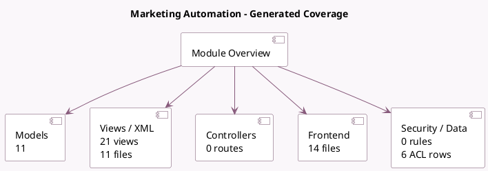

<!-- GENERATED:MODULE -->
---
tags: [odoo, enterprise, module]
---

# Marketing Automation

- Scope: Enterprise Addons
- Source: enterprise/marketing_automation
- Dependencies: [[docs/Community Addons/mass_mailing/mass_mailing|mass_mailing]]

## Summary

Build automated mailing campaigns

## Generated coverage

- Models: 11
- XML files with UI/data artifacts: 11
- Views: 21
- Actions: 13
- Menus: 8
- Rules (ir.rule): 0
- Access CSV entries: 6
- Controller units: 0
- Frontend asset files: 14

## Module map

## Detail notes

- Models: [[docs/Enterprise Addons/marketing_automation/Models|Models]] (11)
- Views and XML: [[docs/Enterprise Addons/marketing_automation/Views|Views]] (11 files)
- Frontend: [[docs/Enterprise Addons/marketing_automation/Frontend|Frontend]] (14 files)

## Key models

- `mail.compose.message`
- `mailing.mailing`
- `mailing.trace`
- `mailing.trace.report`
- `marketing.activity`
- `marketing.campaign`
- `marketing.campaign.test`
- `marketing.participant`
- `marketing.trace`
- `utm.campaign`
- `utm.source`

## Navigation

- [[../Enterprise Addons/Enterprise Addons|Back to scope]]
- [[../../docs/docs|Back to docs]]

<!-- GENERATED:MODULE -->

