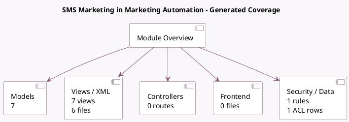

<!-- GENERATED:MODULE -->
---
tags: [odoo, enterprise, module]
---

# SMS Marketing in Marketing Automation

- Scope: Enterprise Addons
- Source: enterprise/marketing_automation_sms
- Dependencies: [[docs/Enterprise Addons/marketing_automation/marketing_automation|marketing_automation]], [[docs/Community Addons/mass_mailing_sms/mass_mailing_sms|mass_mailing_sms]]

## Summary

Integrate SMS Marketing in marketing campaigns

## Generated coverage

- Models: 7
- XML files with UI/data artifacts: 6
- Views: 7
- Actions: 4
- Menus: 0
- Rules (ir.rule): 1
- Access CSV entries: 1
- Controller units: 0
- Frontend asset files: 0

## Module map

## Detail notes

- Models: [[docs/Enterprise Addons/marketing_automation_sms/Models|Models]] (7)
- Views and XML: [[docs/Enterprise Addons/marketing_automation_sms/Views|Views]] (6 files)

## Key models

- `mailing.mailing`
- `mailing.trace`
- `marketing.activity`
- `marketing.campaign`
- `marketing.trace`
- `sms.composer`
- `sms.tracker`

## Navigation

- [[../Enterprise Addons/Enterprise Addons|Back to scope]]
- [[../../docs/docs|Back to docs]]

<!-- GENERATED:MODULE -->

