<!-- GENERATED:MODEL -->
---
tags: [odoo, enterprise, generated, model]
---

# marketing.activity

- Module: [[docs/Enterprise Addons/marketing_automation_whatsapp/marketing_automation_whatsapp|marketing_automation_whatsapp]]
- Scope: Enterprise Addons
- Defined in module: extension only
- Source files: `models/marketing_activity.py`
- Python classes: `MarketingActivity`

## Field footprint

- Detected fields: 5
- Field types: `Boolean` x 1, `Many2one` x 1, `Selection` x 3
- Relation fields: 1

## Sample fields

- `activity_type`: `Selection`
- `trigger_category`: `Selection` (compute `_compute_trigger_category`)
- `trigger_type`: `Selection`
- `whatsapp_error`: `Boolean` (comodel `Whatsapp Error`, compute `_compute_whatsapp_error`, store `True`)
- `whatsapp_template_id`: `Many2one` (comodel `whatsapp.template`, compute `_compute_whatsapp_template_id`, store `True`)

## Method hints

- Detected methods: 14
- Action methods: `action_view_clicked_wa`, `action_view_delivered_wa`, `action_view_read_wa`, `action_view_replied_wa`, `action_view_sent_wa`
- Compute methods: `_compute_mass_mailing_id`, `_compute_trigger_category`, `_compute_whatsapp_error`, `_compute_whatsapp_template_id`
- Onchange methods: `_compute_whatsapp_error`

## Direct relation diagram

```plantuml
@startuml
!define ODOO_COLOR_PRIMARY #714B67
!define ODOO_COLOR_ACCENT #875A7B
!define ODOO_COLOR_BG #FAF7FA

skinparam backgroundColor ODOO_COLOR_BG
skinparam defaultTextAlignment left
skinparam ArrowColor ODOO_COLOR_ACCENT
skinparam ClassBackgroundColor white
skinparam ClassBorderColor ODOO_COLOR_PRIMARY
skinparam ComponentBackgroundColor white
skinparam ComponentBorderColor ODOO_COLOR_PRIMARY
skinparam NoteBackgroundColor #FFF8FF
skinparam NoteBorderColor ODOO_COLOR_ACCENT
skinparam SequenceLifeLineBorderColor ODOO_COLOR_ACCENT
skinparam SequenceLifeLineBackgroundColor #FFFFFF
skinparam SequenceParticipantBorderColor ODOO_COLOR_PRIMARY
skinparam SequenceParticipantBackgroundColor #FFFFFF
skinparam sequence {
  ArrowColor ODOO_COLOR_ACCENT
  ActorBorderColor ODOO_COLOR_PRIMARY
}
title marketing.activity - Direct Relations
class "marketing.activity" as marketing_activity
class "whatsapp.template" as whatsapp_template
marketing_activity --> whatsapp_template : whatsapp_template_id
@enduml
```

## Navigation

- **Parent:** [[docs/Enterprise Addons/marketing_automation_whatsapp/Models]]

<!-- GENERATED:MODEL -->
