<!-- GENERATED:MODEL -->
---
tags: [odoo, enterprise, generated, model]
---

# whatsapp.message

- Module: [[docs/Enterprise Addons/marketing_automation_whatsapp/marketing_automation_whatsapp|marketing_automation_whatsapp]]
- Scope: Enterprise Addons
- Defined in module: extension only
- Source files: `models/whatsapp_message.py`
- Python classes: `WhatsappMessage`

## Field footprint

- Detected fields: 2
- Field types: `Datetime` x 1, `One2many` x 1
- Relation fields: 1

## Sample fields

- `links_click_datetime`: `Datetime` (comodel `Clicked On`)
- `marketing_trace_ids`: `One2many` (comodel `marketing.trace`)

## Method hints

- Detected methods: 4
- Action methods: none
- Compute methods: none
- Onchange methods: none

## Direct relation diagram

```plantuml
@startuml
!define ODOO_COLOR_PRIMARY #714B67
!define ODOO_COLOR_ACCENT #875A7B
!define ODOO_COLOR_BG #FAF7FA

skinparam backgroundColor ODOO_COLOR_BG
skinparam defaultTextAlignment left
skinparam ArrowColor ODOO_COLOR_ACCENT
skinparam ClassBackgroundColor white
skinparam ClassBorderColor ODOO_COLOR_PRIMARY
skinparam ComponentBackgroundColor white
skinparam ComponentBorderColor ODOO_COLOR_PRIMARY
skinparam NoteBackgroundColor #FFF8FF
skinparam NoteBorderColor ODOO_COLOR_ACCENT
skinparam SequenceLifeLineBorderColor ODOO_COLOR_ACCENT
skinparam SequenceLifeLineBackgroundColor #FFFFFF
skinparam SequenceParticipantBorderColor ODOO_COLOR_PRIMARY
skinparam SequenceParticipantBackgroundColor #FFFFFF
skinparam sequence {
  ArrowColor ODOO_COLOR_ACCENT
  ActorBorderColor ODOO_COLOR_PRIMARY
}
title whatsapp.message - Direct Relations
class "whatsapp.message" as whatsapp_message
class "marketing.trace" as marketing_trace
whatsapp_message --|> marketing_trace : marketing_trace_ids
@enduml
```

## Navigation

- **Parent:** [[docs/Enterprise Addons/marketing_automation_whatsapp/Models]]

<!-- GENERATED:MODEL -->
