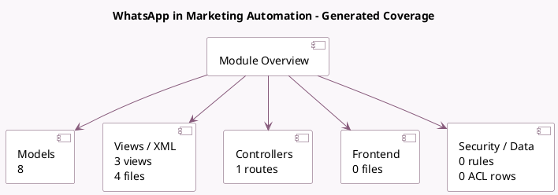

<!-- GENERATED:MODULE -->
---
tags: [odoo, enterprise, module]
---

# WhatsApp in Marketing Automation

- Scope: Enterprise Addons
- Source: enterprise/marketing_automation_whatsapp
- Dependencies: [[docs/Enterprise Addons/marketing_automation/marketing_automation|marketing_automation]], [[docs/Enterprise Addons/whatsapp/whatsapp|whatsapp]]

## Summary

Integrate WhatsApp in marketing campaigns

## Generated coverage

- Models: 8
- XML files with UI/data artifacts: 4
- Views: 3
- Actions: 1
- Menus: 0
- Rules (ir.rule): 0
- Access CSV entries: 0
- Controller units: 1
- Frontend asset files: 0

## Module map

## Detail notes

- Models: [[docs/Enterprise Addons/marketing_automation_whatsapp/Models|Models]] (8)
- Views and XML: [[docs/Enterprise Addons/marketing_automation_whatsapp/Views|Views]] (4 files)
- Controllers: [[docs/Enterprise Addons/marketing_automation_whatsapp/Controllers|Controllers]] (1)

## Key models

- `discuss.channel`
- `link.tracker.click`
- `marketing.activity`
- `marketing.campaign`
- `marketing.trace`
- `whatsapp.message`
- `whatsapp.template`
- `whatsapp.template.button`

## Navigation

- [[../Enterprise Addons/Enterprise Addons|Back to scope]]
- [[../../docs/docs|Back to docs]]

<!-- GENERATED:MODULE -->

