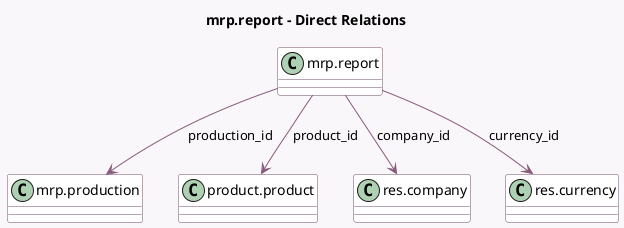

<!-- GENERATED:MODEL -->
---
tags: [odoo, enterprise, generated, model]
---

# mrp.report

- Module: [[docs/Enterprise Addons/mrp_account_enterprise/mrp_account_enterprise|mrp_account_enterprise]]
- Scope: Enterprise Addons
- Defined in module: yes
- Source files: `reports/mrp_report.py`
- Python classes: `MrpReport`
- Description: Manufacturing Report

## Field footprint

- Detected fields: 22
- Field types: `Datetime` x 1, `Float` x 5, `Id` x 1, `Many2one` x 4, `Monetary` x 11
- Relation fields: 4

## Sample fields

- `byproduct_cost`: `Monetary` (comodel `By-Products Total Cost`)
- `company_id`: `Many2one` (comodel `res.company`)
- `component_cost`: `Monetary` (comodel `Total Component Cost`)
- `currency_id`: `Many2one` (comodel `res.currency`)
- `date_finished`: `Datetime` (comodel `End Date`)
- `duration`: `Float` (comodel `Total Duration of Operations`)
- `expected_component_cost_unit`: `Monetary` (comodel `Expected Component Cost / Unit`)
- `expected_employee_cost_unit`: `Monetary` (comodel `Expected Employee Cost / Unit`)
- `expected_operation_cost_unit`: `Monetary` (comodel `Expected Operation Cost / Unit`)
- `expected_total_cost_unit`: `Monetary` (comodel `Expected Total Cost / Unit`)
- `id`: `Id`
- `operation_cost`: `Monetary` (comodel `Total Operation Cost`)
- `product_id`: `Many2one` (comodel `product.product`)
- `production_id`: `Many2one` (comodel `mrp.production`)
- `qty_demanded`: `Float` (comodel `Quantity Demanded`)
- `qty_produced`: `Float` (comodel `Quantity Produced`)
- `total_cost`: `Monetary` (comodel `Total Cost`)
- `unit_component_cost`: `Monetary` (comodel `Component Cost / Unit`)
- `unit_cost`: `Monetary` (comodel `Cost / Unit`)
- `unit_duration`: `Float` (comodel `Duration of Operations / Unit`)

## Method hints

- Detected methods: 16
- Action methods: none
- Compute methods: none
- Onchange methods: none

## Direct relation diagram

## Navigation

- **Parent:** [[docs/Enterprise Addons/mrp_account_enterprise/Models]]

<!-- GENERATED:MODEL -->
