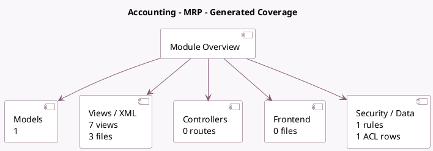

<!-- GENERATED:MODULE -->
---
tags: [odoo, enterprise, module]
---

# Accounting - MRP

- Scope: Enterprise Addons
- Source: enterprise/mrp_account_enterprise
- Dependencies: [[docs/Community Addons/mrp_account/mrp_account|mrp_account]]

## Summary

Analytic accounting in Manufacturing

## Generated coverage

- Models: 1
- XML files with UI/data artifacts: 3
- Views: 7
- Actions: 1
- Menus: 1
- Rules (ir.rule): 1
- Access CSV entries: 1
- Controller units: 0
- Frontend asset files: 0

## Module map

## Detail notes

- Models: [[docs/Enterprise Addons/mrp_account_enterprise/Models|Models]] (1)
- Views and XML: [[docs/Enterprise Addons/mrp_account_enterprise/Views|Views]] (3 files)

## Key models

- `mrp.report`

## Navigation

- [[../Enterprise Addons/Enterprise Addons|Back to scope]]
- [[../../docs/docs|Back to docs]]

<!-- GENERATED:MODULE -->

