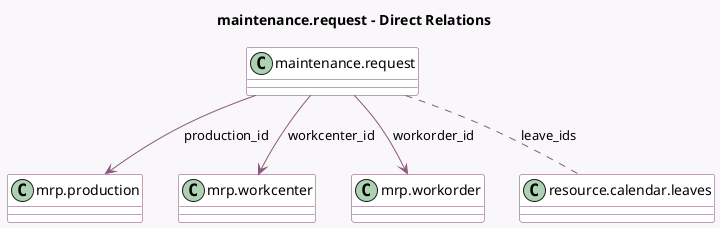

<!-- GENERATED:MODEL -->
---
tags: [odoo, enterprise, generated, model]
---

# maintenance.request

- Module: [[docs/Enterprise Addons/mrp_maintenance/mrp_maintenance|mrp_maintenance]]
- Scope: Enterprise Addons
- Defined in module: extension only
- Source files: `models/mrp_maintenance.py`
- Python classes: `MaintenanceRequest`

## Field footprint

- Detected fields: 10
- Field types: `Boolean` x 1, `Integer` x 1, `Many2many` x 1, `Many2one` x 6, `Selection` x 1
- Relation fields: 7

## Sample fields

- `block_workcenter`: `Boolean` (comodel `Block Workcenter`)
- `company_id`: `Many2one`
- `equipment_id`: `Many2one` (compute `_compute_equipment_id`, store `True`)
- `leave_ids`: `Many2many` (comodel `resource.calendar.leaves`)
- `maintenance_for`: `Selection`
- `production_company_id`: `Many2one` (related `production_id.company_id`)
- `production_id`: `Many2one` (comodel `mrp.production`)
- `recurring_leaves_count`: `Integer` (comodel `Additional Leaves to Plan Ahead`)
- `workcenter_id`: `Many2one` (comodel `mrp.workcenter`, compute `_compute_workcenter_id`, store `True`)
- `workorder_id`: `Many2one` (comodel `mrp.workorder`)

## Method hints

- Detected methods: 11
- Action methods: none
- Compute methods: `_compute_equipment_id`, `_compute_maintenance_team_id`, `_compute_user_id`, `_compute_workcenter_id`
- Onchange methods: none

## Direct relation diagram

## Navigation

- **Parent:** [[docs/Enterprise Addons/mrp_maintenance/Models]]

<!-- GENERATED:MODEL -->
