<!-- GENERATED:MODEL -->
---
tags: [odoo, enterprise, generated, model]
---

# mrp.workcenter

- Module: [[docs/Enterprise Addons/mrp_maintenance/mrp_maintenance|mrp_maintenance]]
- Scope: Enterprise Addons
- Defined in module: yes
- Source files: `models/mrp_maintenance.py`
- Python classes: `MrpWorkcenter`
- Inherits: `mail.activity.mixin`, `mail.thread`, `maintenance.mixin`

## Field footprint

- Detected fields: 2
- Field types: `One2many` x 2
- Relation fields: 2

## Sample fields

- `equipment_ids`: `One2many` (comodel `maintenance.equipment`)
- `maintenance_ids`: `One2many` (comodel `maintenance.request`)

## Method hints

- Detected methods: 2
- Action methods: none
- Compute methods: none
- Onchange methods: none

## Direct relation diagram

```plantuml
@startuml
!define ODOO_COLOR_PRIMARY #714B67
!define ODOO_COLOR_ACCENT #875A7B
!define ODOO_COLOR_BG #FAF7FA

skinparam backgroundColor ODOO_COLOR_BG
skinparam defaultTextAlignment left
skinparam ArrowColor ODOO_COLOR_ACCENT
skinparam ClassBackgroundColor white
skinparam ClassBorderColor ODOO_COLOR_PRIMARY
skinparam ComponentBackgroundColor white
skinparam ComponentBorderColor ODOO_COLOR_PRIMARY
skinparam NoteBackgroundColor #FFF8FF
skinparam NoteBorderColor ODOO_COLOR_ACCENT
skinparam SequenceLifeLineBorderColor ODOO_COLOR_ACCENT
skinparam SequenceLifeLineBackgroundColor #FFFFFF
skinparam SequenceParticipantBorderColor ODOO_COLOR_PRIMARY
skinparam SequenceParticipantBackgroundColor #FFFFFF
skinparam sequence {
  ArrowColor ODOO_COLOR_ACCENT
  ActorBorderColor ODOO_COLOR_PRIMARY
}
title mrp.workcenter - Direct Relations
class "mrp.workcenter" as mrp_workcenter
class "maintenance.equipment" as maintenance_equipment
class "maintenance.request" as maintenance_request
mrp_workcenter --|> maintenance_equipment : equipment_ids
mrp_workcenter --|> maintenance_request : maintenance_ids
@enduml
```

## Navigation

- **Parent:** [[docs/Enterprise Addons/mrp_maintenance/Models]]

<!-- GENERATED:MODEL -->
