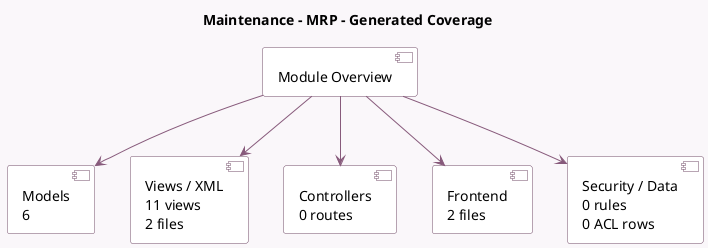

<!-- GENERATED:MODULE -->
---
tags: [odoo, enterprise, module]
---

# Maintenance - MRP

- Scope: Enterprise Addons
- Source: enterprise/mrp_maintenance
- Dependencies: [[docs/Enterprise Addons/mrp_workorder/mrp_workorder|mrp_workorder]], [[docs/Community Addons/stock_maintenance/stock_maintenance|stock_maintenance]]

## Summary

Schedule and manage maintenance on machine and tools.

## Generated coverage

- Models: 6
- XML files with UI/data artifacts: 2
- Views: 11
- Actions: 3
- Menus: 3
- Rules (ir.rule): 0
- Access CSV entries: 0
- Controller units: 0
- Frontend asset files: 2

## Module map

## Detail notes

- Models: [[docs/Enterprise Addons/mrp_maintenance/Models|Models]] (6)
- Views and XML: [[docs/Enterprise Addons/mrp_maintenance/Views|Views]] (2 files)
- Frontend: [[docs/Enterprise Addons/mrp_maintenance/Frontend|Frontend]] (2 files)

## Key models

- `maintenance.equipment`
- `maintenance.request`
- `maintenance.stage`
- `mrp.production`
- `mrp.workcenter`
- `mrp.workorder`

## Navigation

- [[../Enterprise Addons/Enterprise Addons|Back to scope]]
- [[../../docs/docs|Back to docs]]

<!-- GENERATED:MODULE -->

