<!-- GENERATED:MODEL -->
---
tags: [odoo, enterprise, generated, model]
---

# mrp.mps.forecast.details

- Module: [[docs/Enterprise Addons/mrp_mps/mrp_mps|mrp_mps]]
- Scope: Enterprise Addons
- Defined in module: yes
- Source files: `wizard/mrp_mps_forecast_details.py`
- Python classes: `MrpMpsForecastDetails`
- Description: Forecast Demand Details

## Field footprint

- Detected fields: 9
- Field types: `Char` x 3, `Integer` x 4, `Many2many` x 2
- Relation fields: 2

## Sample fields

- `manufacture_qty`: `Integer` (comodel `Quantity from Manufacturing Order`, compute `_compute_quantity_and_label`)
- `manufacture_string`: `Char` (compute `_compute_quantity_and_label`)
- `move_ids`: `Many2many` (comodel `stock.move`)
- `moves_qty`: `Integer` (comodel `Quantity from Incoming Moves`, compute `_compute_quantity_and_label`)
- `moves_string`: `Char` (compute `_compute_quantity_and_label`)
- `purchase_order_line_ids`: `Many2many` (comodel `purchase.order.line`)
- `rfq_qty`: `Integer` (comodel `Quantity from RFQ`, compute `_compute_quantity_and_label`)
- `rfq_string`: `Char` (compute `_compute_quantity_and_label`)
- `total_qty`: `Integer` (comodel `Actual Replenishment`, compute `_compute_quantity_and_label`)

## Method hints

- Detected methods: 4
- Action methods: `action_open_incoming_moves_details`, `action_open_mo_details`, `action_open_rfq_details`
- Compute methods: `_compute_quantity_and_label`
- Onchange methods: none

## Direct relation diagram

```plantuml
@startuml
!define ODOO_COLOR_PRIMARY #714B67
!define ODOO_COLOR_ACCENT #875A7B
!define ODOO_COLOR_BG #FAF7FA

skinparam backgroundColor ODOO_COLOR_BG
skinparam defaultTextAlignment left
skinparam ArrowColor ODOO_COLOR_ACCENT
skinparam ClassBackgroundColor white
skinparam ClassBorderColor ODOO_COLOR_PRIMARY
skinparam ComponentBackgroundColor white
skinparam ComponentBorderColor ODOO_COLOR_PRIMARY
skinparam NoteBackgroundColor #FFF8FF
skinparam NoteBorderColor ODOO_COLOR_ACCENT
skinparam SequenceLifeLineBorderColor ODOO_COLOR_ACCENT
skinparam SequenceLifeLineBackgroundColor #FFFFFF
skinparam SequenceParticipantBorderColor ODOO_COLOR_PRIMARY
skinparam SequenceParticipantBackgroundColor #FFFFFF
skinparam sequence {
  ArrowColor ODOO_COLOR_ACCENT
  ActorBorderColor ODOO_COLOR_PRIMARY
}
title mrp.mps.forecast.details - Direct Relations
class "mrp.mps.forecast.details" as mrp_mps_forecast_details
class "purchase.order.line" as purchase_order_line
class "stock.move" as stock_move
mrp_mps_forecast_details .. stock_move : move_ids
mrp_mps_forecast_details .. purchase_order_line : purchase_order_line_ids
@enduml
```

## Navigation

- **Parent:** [[docs/Enterprise Addons/mrp_mps/Models]]

<!-- GENERATED:MODEL -->
