<!-- GENERATED:MODEL -->
---
tags: [odoo, enterprise, generated, model]
---

# mrp.mps.forecast.suggestion

- Module: [[docs/Enterprise Addons/mrp_mps/mrp_mps|mrp_mps]]
- Scope: Enterprise Addons
- Defined in module: yes
- Source files: `wizard/mrp_mps_forecast_suggestion.py`
- Python classes: `MrpMpsForecastSuggestion`
- Description: Forecast Demand Suggestion

## Field footprint

- Detected fields: 8
- Field types: `Char` x 1, `Float` x 2, `Integer` x 2, `Many2one` x 2, `Selection` x 1
- Relation fields: 2

## Sample fields

- `based_on`: `Selection`
- `based_on_readonly`: `Char` (compute `_compute_suggestion_fields`)
- `mrp_mps_id`: `Many2one` (comodel `mrp.production.schedule`)
- `percent_factor`: `Integer`
- `period`: `Integer`
- `product_id`: `Many2one` (comodel `product.product`, related `mrp_mps_id.product_id`)
- `quantity`: `Float` (compute `_compute_suggestion_fields`)
- `quantity_before_scale`: `Float` (compute `_compute_suggestion_fields`)

## Method hints

- Detected methods: 7
- Action methods: `action_open_suggest_forecasted_form_view`
- Compute methods: `_compute_suggestion_fields`
- Onchange methods: none

## Direct relation diagram

```plantuml
@startuml
!define ODOO_COLOR_PRIMARY #714B67
!define ODOO_COLOR_ACCENT #875A7B
!define ODOO_COLOR_BG #FAF7FA

skinparam backgroundColor ODOO_COLOR_BG
skinparam defaultTextAlignment left
skinparam ArrowColor ODOO_COLOR_ACCENT
skinparam ClassBackgroundColor white
skinparam ClassBorderColor ODOO_COLOR_PRIMARY
skinparam ComponentBackgroundColor white
skinparam ComponentBorderColor ODOO_COLOR_PRIMARY
skinparam NoteBackgroundColor #FFF8FF
skinparam NoteBorderColor ODOO_COLOR_ACCENT
skinparam SequenceLifeLineBorderColor ODOO_COLOR_ACCENT
skinparam SequenceLifeLineBackgroundColor #FFFFFF
skinparam SequenceParticipantBorderColor ODOO_COLOR_PRIMARY
skinparam SequenceParticipantBackgroundColor #FFFFFF
skinparam sequence {
  ArrowColor ODOO_COLOR_ACCENT
  ActorBorderColor ODOO_COLOR_PRIMARY
}
title mrp.mps.forecast.suggestion - Direct Relations
class "mrp.mps.forecast.suggestion" as mrp_mps_forecast_suggestion
class "mrp.production.schedule" as mrp_production_schedule
class "product.product" as product_product
mrp_mps_forecast_suggestion --> mrp_production_schedule : mrp_mps_id
mrp_mps_forecast_suggestion --> product_product : product_id
@enduml
```

## Navigation

- **Parent:** [[docs/Enterprise Addons/mrp_mps/Models]]

<!-- GENERATED:MODEL -->
