<!-- GENERATED:MODEL -->
---
tags: [odoo, enterprise, generated, model]
---

# mrp.product.forecast

- Module: [[docs/Enterprise Addons/mrp_mps/mrp_mps|mrp_mps]]
- Scope: Enterprise Addons
- Defined in module: yes
- Source files: `models/mrp_mps.py`
- Python classes: `MrpProductForecast`
- Description: Product Forecast at Date

## Field footprint

- Detected fields: 6
- Field types: `Boolean` x 2, `Date` x 1, `Float` x 2, `Many2one` x 1
- Relation fields: 1

## Sample fields

- `date`: `Date` (comodel `Date`)
- `forecast_qty`: `Float` (comodel `Demand Forecast`)
- `procurement_launched`: `Boolean` (comodel `Procurement has been run for this forecast`)
- `production_schedule_id`: `Many2one` (comodel `mrp.production.schedule`)
- `replenish_qty`: `Float` (comodel `To Replenish`)
- `replenish_qty_updated`: `Boolean` (comodel `Replenish_qty has been manually updated`)

## Method hints

- Detected methods: 0
- Action methods: none
- Compute methods: none
- Onchange methods: none

## Direct relation diagram

```plantuml
@startuml
!define ODOO_COLOR_PRIMARY #714B67
!define ODOO_COLOR_ACCENT #875A7B
!define ODOO_COLOR_BG #FAF7FA

skinparam backgroundColor ODOO_COLOR_BG
skinparam defaultTextAlignment left
skinparam ArrowColor ODOO_COLOR_ACCENT
skinparam ClassBackgroundColor white
skinparam ClassBorderColor ODOO_COLOR_PRIMARY
skinparam ComponentBackgroundColor white
skinparam ComponentBorderColor ODOO_COLOR_PRIMARY
skinparam NoteBackgroundColor #FFF8FF
skinparam NoteBorderColor ODOO_COLOR_ACCENT
skinparam SequenceLifeLineBorderColor ODOO_COLOR_ACCENT
skinparam SequenceLifeLineBackgroundColor #FFFFFF
skinparam SequenceParticipantBorderColor ODOO_COLOR_PRIMARY
skinparam SequenceParticipantBackgroundColor #FFFFFF
skinparam sequence {
  ArrowColor ODOO_COLOR_ACCENT
  ActorBorderColor ODOO_COLOR_PRIMARY
}
title mrp.product.forecast - Direct Relations
class "mrp.product.forecast" as mrp_product_forecast
class "mrp.production.schedule" as mrp_production_schedule
mrp_product_forecast --> mrp_production_schedule : production_schedule_id
@enduml
```

## Navigation

- **Parent:** [[docs/Enterprise Addons/mrp_mps/Models]]

<!-- GENERATED:MODEL -->
