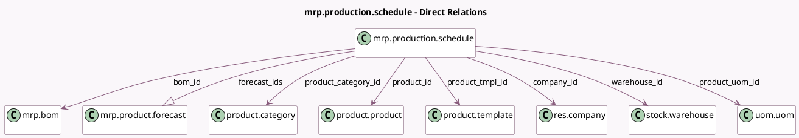

<!-- GENERATED:MODEL -->
---
tags: [odoo, enterprise, generated, model]
---

# mrp.production.schedule

- Module: [[docs/Enterprise Addons/mrp_mps/mrp_mps|mrp_mps]]
- Scope: Enterprise Addons
- Defined in module: yes
- Source files: `models/mrp_mps.py`
- Python classes: `MrpProductionSchedule`
- Description: Schedule the production of Product in a warehouse
- Inherits: `stock.replenish.mixin`

## Field footprint

- Detected fields: 17
- Field types: `Boolean` x 2, `Float` x 2, `Integer` x 1, `Many2one` x 9, `One2many` x 1, `Selection` x 2
- Relation fields: 10

## Sample fields

- `bom_id`: `Many2one` (comodel `mrp.bom`)
- `company_id`: `Many2one` (comodel `res.company`)
- `forecast_ids`: `One2many` (comodel `mrp.product.forecast`)
- `forecast_target_qty`: `Float` (comodel `Safety Stock Target`)
- `is_indirect`: `Boolean` (comodel `Indirect demand product`)
- `is_manufacture_route`: `Boolean` (compute `_compute_is_manufacture_route`)
- `min_to_replenish_qty`: `Float` (comodel `Minimum to Replenish`)
- `mps_sequence`: `Integer` (comodel `Sequence`)
- `product_category_id`: `Many2one` (comodel `product.category`, related `product_id.product_tmpl_id.categ_id`)
- `product_id`: `Many2one` (comodel `product.product`)
- `product_tmpl_id`: `Many2one` (comodel `product.template`, related `product_id.product_tmpl_id`)
- `product_uom_id`: `Many2one` (comodel `uom.uom`, related `product_id.uom_id`)
- `replenish_state`: `Selection` (store `False`)
- `replenish_trigger`: `Selection`
- `route_id`: `Many2one` (compute `_compute_route_and_supplier`, store `True`)
- `supplier_id`: `Many2one` (compute `_compute_route_and_supplier`, store `True`)
- `warehouse_id`: `Many2one` (comodel `stock.warehouse`)

## Method hints

- Detected methods: 37
- Action methods: `action_cron_replenish`, `action_open_actual_demand_details`, `action_open_actual_replenishment_details`, `action_replenish`, `action_toggle_is_indirect`
- Compute methods: `_compute_is_manufacture_route`, `_compute_route_and_supplier`
- Onchange methods: none

## Direct relation diagram

## Navigation

- **Parent:** [[docs/Enterprise Addons/mrp_mps/Models]]

<!-- GENERATED:MODEL -->
