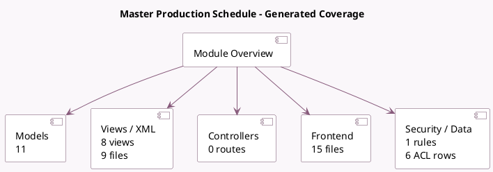

<!-- GENERATED:MODULE -->
---
tags: [odoo, enterprise, module]
---

# Master Production Schedule

- Scope: Enterprise Addons
- Source: enterprise/mrp_mps
- Dependencies: [[docs/Community Addons/base_import/base_import|base_import]], [[docs/Community Addons/mrp/mrp|mrp]], [[docs/Community Addons/purchase_stock/purchase_stock|purchase_stock]]

## Summary

Master Production Schedule

## Generated coverage

- Models: 11
- XML files with UI/data artifacts: 9
- Views: 8
- Actions: 2
- Menus: 3
- Rules (ir.rule): 1
- Access CSV entries: 6
- Controller units: 0
- Frontend asset files: 15

## Module map

## Detail notes

- Models: [[docs/Enterprise Addons/mrp_mps/Models|Models]] (11)
- Views and XML: [[docs/Enterprise Addons/mrp_mps/Views|Views]] (9 files)
- Frontend: [[docs/Enterprise Addons/mrp_mps/Frontend|Frontend]] (15 files)

## Key models

- `mrp.bom`
- `mrp.mps.forecast.details`
- `mrp.mps.forecast.suggestion`
- `mrp.product.forecast`
- `mrp.production.schedule`
- `product.product`
- `product.template`
- `purchase.order`
- `res.company`
- `res.config.settings`
- `stock.rule`

## Navigation

- [[../Enterprise Addons/Enterprise Addons|Back to scope]]
- [[../../docs/docs|Back to docs]]

<!-- GENERATED:MODULE -->

