<!-- GENERATED:MODEL -->
---
tags: [odoo, enterprise, generated, model]
---

# mrp.bom

- Module: [[docs/Enterprise Addons/mrp_plm/mrp_plm|mrp_plm]]
- Scope: Enterprise Addons
- Defined in module: extension only
- Source files: `models/mrp_bom.py`
- Python classes: `MrpBom`

## Field footprint

- Detected fields: 6
- Field types: `Boolean` x 1, `Image` x 1, `Integer` x 2, `Many2one` x 1, `One2many` x 1
- Relation fields: 2

## Sample fields

- `active`: `Boolean` (comodel `Production Ready`)
- `eco_count`: `Integer` (comodel `# ECOs`, compute `_compute_eco_data`)
- `eco_ids`: `One2many` (comodel `mrp.eco`)
- `image_128`: `Image` (related `product_tmpl_id.image_128`)
- `previous_bom_id`: `Many2one` (comodel `mrp.bom`)
- `version`: `Integer` (comodel `Version`)

## Method hints

- Detected methods: 5
- Action methods: none
- Compute methods: `_compute_eco_data`
- Onchange methods: none

## Direct relation diagram

```plantuml
@startuml
!define ODOO_COLOR_PRIMARY #714B67
!define ODOO_COLOR_ACCENT #875A7B
!define ODOO_COLOR_BG #FAF7FA

skinparam backgroundColor ODOO_COLOR_BG
skinparam defaultTextAlignment left
skinparam ArrowColor ODOO_COLOR_ACCENT
skinparam ClassBackgroundColor white
skinparam ClassBorderColor ODOO_COLOR_PRIMARY
skinparam ComponentBackgroundColor white
skinparam ComponentBorderColor ODOO_COLOR_PRIMARY
skinparam NoteBackgroundColor #FFF8FF
skinparam NoteBorderColor ODOO_COLOR_ACCENT
skinparam SequenceLifeLineBorderColor ODOO_COLOR_ACCENT
skinparam SequenceLifeLineBackgroundColor #FFFFFF
skinparam SequenceParticipantBorderColor ODOO_COLOR_PRIMARY
skinparam SequenceParticipantBackgroundColor #FFFFFF
skinparam sequence {
  ArrowColor ODOO_COLOR_ACCENT
  ActorBorderColor ODOO_COLOR_PRIMARY
}
title mrp.bom - Direct Relations
class "mrp.bom" as mrp_bom
class "mrp.bom" as mrp_bom
class "mrp.eco" as mrp_eco
mrp_bom --> mrp_bom : previous_bom_id
mrp_bom --|> mrp_eco : eco_ids
@enduml
```

## Navigation

- **Parent:** [[docs/Enterprise Addons/mrp_plm/Models]]

<!-- GENERATED:MODEL -->
