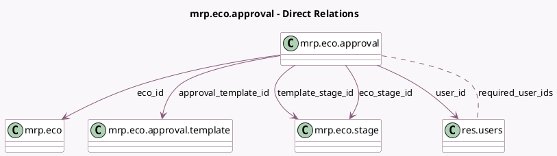

<!-- GENERATED:MODEL -->
---
tags: [odoo, enterprise, generated, model]
---

# mrp.eco.approval

- Module: [[docs/Enterprise Addons/mrp_plm/mrp_plm|mrp_plm]]
- Scope: Enterprise Addons
- Defined in module: yes
- Source files: `models/mrp_eco.py`
- Python classes: `MrpEcoApproval`
- Description: ECO Approval

## Field footprint

- Detected fields: 13
- Field types: `Boolean` x 4, `Char` x 1, `Datetime` x 1, `Many2many` x 1, `Many2one` x 5, `Selection` x 1
- Relation fields: 6

## Sample fields

- `approval_date`: `Datetime` (comodel `Approval Date`)
- `approval_template_id`: `Many2one` (comodel `mrp.eco.approval.template`)
- `awaiting_my_validation`: `Boolean` (compute `_compute_awaiting_my_validation`)
- `eco_id`: `Many2one` (comodel `mrp.eco`)
- `eco_stage_id`: `Many2one` (comodel `mrp.eco.stage`, related `eco_id.stage_id`)
- `is_approved`: `Boolean` (compute `_compute_is_approved`, store `True`)
- `is_closed`: `Boolean`
- `is_rejected`: `Boolean` (compute `_compute_is_rejected`, store `True`)
- `name`: `Char` (comodel `Role`, related `approval_template_id.name`)
- `required_user_ids`: `Many2many` (comodel `res.users`, related `approval_template_id.user_ids`)
- `status`: `Selection`
- `template_stage_id`: `Many2one` (comodel `mrp.eco.stage`, related `approval_template_id.stage_id`)
- `user_id`: `Many2one` (comodel `res.users`)

## Method hints

- Detected methods: 4
- Action methods: none
- Compute methods: `_compute_awaiting_my_validation`, `_compute_is_approved`, `_compute_is_rejected`
- Onchange methods: none

## Direct relation diagram

## Navigation

- **Parent:** [[docs/Enterprise Addons/mrp_plm/Models]]

<!-- GENERATED:MODEL -->
