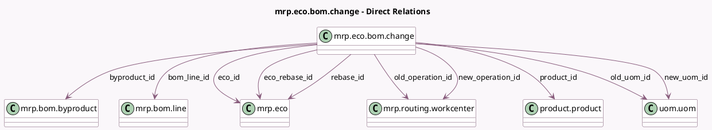

<!-- GENERATED:MODEL -->
---
tags: [odoo, enterprise, generated, model]
---

# mrp.eco.bom.change

- Module: [[docs/Enterprise Addons/mrp_plm/mrp_plm|mrp_plm]]
- Scope: Enterprise Addons
- Defined in module: yes
- Source files: `models/mrp_eco.py`
- Python classes: `MrpEcoBomChange`
- Description: ECO BoM changes

## Field footprint

- Detected fields: 18
- Field types: `Boolean` x 1, `Char` x 2, `Float` x 3, `Many2one` x 11, `Selection` x 1
- Relation fields: 11

## Sample fields

- `bom_line_id`: `Many2one` (comodel `mrp.bom.line`)
- `byproduct_id`: `Many2one` (comodel `mrp.bom.byproduct`)
- `change_type`: `Selection`
- `company_id`: `Many2one` (related `eco_id.company_id`)
- `conflict`: `Boolean`
- `eco_id`: `Many2one` (comodel `mrp.eco`)
- `eco_rebase_id`: `Many2one` (comodel `mrp.eco`)
- `new_operation_id`: `Many2one` (comodel `mrp.routing.workcenter`)
- `new_product_qty`: `Float` (comodel `New revision quantity`)
- `new_uom_id`: `Many2one` (comodel `uom.uom`)
- `old_operation_id`: `Many2one` (comodel `mrp.routing.workcenter`)
- `old_product_qty`: `Float` (comodel `Previous revision quantity`)
- `old_uom_id`: `Many2one` (comodel `uom.uom`)
- `operation_change`: `Char` (compute `_compute_change`)
- `product_id`: `Many2one` (comodel `product.product`)
- `rebase_id`: `Many2one` (comodel `mrp.eco`)
- `uom_change`: `Char` (comodel `Unit`, compute `_compute_change`)
- `upd_product_qty`: `Float` (comodel `Quantity`, compute `_compute_upd_product_qty`, store `True`)

## Method hints

- Detected methods: 4
- Action methods: `action_open_byproduct_change`, `action_open_component_change`
- Compute methods: `_compute_change`, `_compute_upd_product_qty`
- Onchange methods: none

## Direct relation diagram

## Navigation

- **Parent:** [[docs/Enterprise Addons/mrp_plm/Models]]

<!-- GENERATED:MODEL -->
