<!-- GENERATED:MODEL -->
---
tags: [odoo, enterprise, generated, model]
---

# mrp.eco

- Module: [[docs/Enterprise Addons/mrp_plm/mrp_plm|mrp_plm]]
- Scope: Enterprise Addons
- Defined in module: yes
- Source files: `models/mrp_eco.py`
- Python classes: `MrpEco`
- Description: Engineering Change Order (ECO)
- Inherits: `mail.activity.mixin`, `mail.thread.cc`

## Field footprint

- Detected fields: 42
- Field types: `Boolean` x 7, `Char` x 5, `Datetime` x 1, `Html` x 1, `Integer` x 3, `Many2many` x 1, `Many2one` x 11, `One2many` x 8, `Selection` x 5
- Relation fields: 20

## Sample fields

- `active`: `Boolean` (comodel `Active`)
- `allow_apply_change`: `Boolean` (comodel `Show Apply Change`, compute `_compute_allow_apply_change`)
- `allow_change_kanban_state`: `Boolean` (comodel `Allow Change Kanban State`, compute `_compute_allow_change_kanban_state`)
- `allow_change_stage`: `Boolean` (comodel `Allow Change Stage`, compute `_compute_allow_change_stage`)
- `approval_ids`: `One2many` (comodel `mrp.eco.approval`)
- `bom_change_ids`: `One2many` (comodel `mrp.eco.bom.change`, compute `_compute_bom_change_ids`, store `True`)
- `bom_change_ids_on_byproduct`: `One2many` (comodel `mrp.eco.bom.change`)
- `bom_change_ids_on_line`: `One2many` (comodel `mrp.eco.bom.change`)
- `bom_id`: `Many2one` (comodel `mrp.bom`)
- `bom_rebase_ids`: `One2many` (comodel `mrp.eco.bom.change`)
- `color`: `Integer` (comodel `Color`)
- `company_id`: `Many2one` (comodel `res.company`)
- `current_bom_id`: `Many2one` (comodel `mrp.bom`)
- `displayed_image_attachment_id`: `Many2one` (comodel `ir.attachment`, related `displayed_image_id.ir_attachment_id`)
- `displayed_image_id`: `Many2one` (comodel `product.document`)
- `document_count`: `Integer` (comodel `# Attachments`, compute `_compute_attachments`)
- `document_ids`: `One2many` (comodel `product.document`)
- `effectivity`: `Selection` (compute `_compute_effectivity`, store `True`)
- `effectivity_date`: `Datetime` (comodel `Effective Date`)
- `kanban_state`: `Selection` (compute `_compute_kanban_state`, store `True`)

## Method hints

- Detected methods: 34
- Action methods: `action_apply`, `action_new_revision`, `action_open_production`, `action_see_attachments`
- Compute methods: `_compute_allow_apply_change`, `_compute_allow_change_kanban_state`, `_compute_allow_change_stage`, `_compute_attachments`, `_compute_bom_change_ids`, `_compute_effectivity`, `_compute_kanban_state`, `_compute_kanban_state_label`, and 3 more
- Onchange methods: `onchange_product_tmpl_id`, `onchange_type_id`

## Direct relation diagram

```plantuml
@startuml
!define ODOO_COLOR_PRIMARY #714B67
!define ODOO_COLOR_ACCENT #875A7B
!define ODOO_COLOR_BG #FAF7FA

skinparam backgroundColor ODOO_COLOR_BG
skinparam defaultTextAlignment left
skinparam ArrowColor ODOO_COLOR_ACCENT
skinparam ClassBackgroundColor white
skinparam ClassBorderColor ODOO_COLOR_PRIMARY
skinparam ComponentBackgroundColor white
skinparam ComponentBorderColor ODOO_COLOR_PRIMARY
skinparam NoteBackgroundColor #FFF8FF
skinparam NoteBorderColor ODOO_COLOR_ACCENT
skinparam SequenceLifeLineBorderColor ODOO_COLOR_ACCENT
skinparam SequenceLifeLineBackgroundColor #FFFFFF
skinparam SequenceParticipantBorderColor ODOO_COLOR_PRIMARY
skinparam SequenceParticipantBackgroundColor #FFFFFF
skinparam sequence {
  ArrowColor ODOO_COLOR_ACCENT
  ActorBorderColor ODOO_COLOR_PRIMARY
}
title mrp.eco - Direct Relations
class "mrp.eco" as mrp_eco
class "ir.attachment" as ir_attachment
class "mrp.bom" as mrp_bom
class "mrp.eco.approval" as mrp_eco_approval
class "mrp.eco.bom.change" as mrp_eco_bom_change
class "mrp.eco.routing.change" as mrp_eco_routing_change
class "mrp.eco.stage" as mrp_eco_stage
class "mrp.eco.tag" as mrp_eco_tag
class "mrp.eco.type" as mrp_eco_type
class "mrp.production" as mrp_production
class "product.document" as product_document
class "product.template" as product_template
class "res.company" as res_company
mrp_eco --> res_users : user_id
mrp_eco --> mrp_eco_type : type_id
mrp_eco --> mrp_eco_stage : stage_id
mrp_eco --> res_company : company_id
mrp_eco .. mrp_eco_tag : tag_ids
mrp_eco --|> mrp_eco_approval : approval_ids
mrp_eco --> product_template : product_tmpl_id
mrp_eco --> mrp_production : production_id
mrp_eco --> mrp_bom : bom_id
mrp_eco --> mrp_bom : new_bom_id
mrp_eco --|> mrp_eco_bom_change : bom_change_ids
mrp_eco --|> mrp_eco_bom_change : bom_change_ids_on_line
mrp_eco --|> mrp_eco_bom_change : bom_change_ids_on_byproduct
mrp_eco --|> mrp_eco_bom_change : bom_rebase_ids
mrp_eco --|> mrp_eco_routing_change : routing_change_ids
mrp_eco --|> product_document : document_ids
mrp_eco --> product_document : displayed_image_id
mrp_eco --> ir_attachment : displayed_image_attachment_id
@enduml
```

## Navigation

- **Parent:** [[docs/Enterprise Addons/mrp_plm/Models]]

<!-- GENERATED:MODEL -->
