<!-- GENERATED:MODEL -->
---
tags: [odoo, enterprise, generated, model]
---

# mrp.eco.routing.change

- Module: [[docs/Enterprise Addons/mrp_plm/mrp_plm|mrp_plm]]
- Scope: Enterprise Addons
- Defined in module: yes
- Source files: `models/mrp_eco.py`
- Python classes: `MrpEcoRoutingChange`
- Description: Eco Routing changes

## Field footprint

- Detected fields: 8
- Field types: `Char` x 2, `Float` x 1, `Integer` x 1, `Many2one` x 3, `Selection` x 1
- Relation fields: 3

## Sample fields

- `change_type`: `Selection`
- `eco_id`: `Many2one` (comodel `mrp.eco`)
- `operation_id`: `Many2one` (comodel `mrp.routing.workcenter`)
- `operation_name`: `Char` (related `operation_id.name`)
- `upd_time_cycle_manual`: `Float` (comodel `Manual Duration Change`)
- `upd_time_mode`: `Char` (comodel `Mode Change`)
- `upd_time_mode_batch`: `Integer` (comodel `Batch count Change`)
- `workcenter_id`: `Many2one` (comodel `mrp.workcenter`)

## Method hints

- Detected methods: 1
- Action methods: `action_open_routing_change_operation`
- Compute methods: none
- Onchange methods: none

## Direct relation diagram

```plantuml
@startuml
!define ODOO_COLOR_PRIMARY #714B67
!define ODOO_COLOR_ACCENT #875A7B
!define ODOO_COLOR_BG #FAF7FA

skinparam backgroundColor ODOO_COLOR_BG
skinparam defaultTextAlignment left
skinparam ArrowColor ODOO_COLOR_ACCENT
skinparam ClassBackgroundColor white
skinparam ClassBorderColor ODOO_COLOR_PRIMARY
skinparam ComponentBackgroundColor white
skinparam ComponentBorderColor ODOO_COLOR_PRIMARY
skinparam NoteBackgroundColor #FFF8FF
skinparam NoteBorderColor ODOO_COLOR_ACCENT
skinparam SequenceLifeLineBorderColor ODOO_COLOR_ACCENT
skinparam SequenceLifeLineBackgroundColor #FFFFFF
skinparam SequenceParticipantBorderColor ODOO_COLOR_PRIMARY
skinparam SequenceParticipantBackgroundColor #FFFFFF
skinparam sequence {
  ArrowColor ODOO_COLOR_ACCENT
  ActorBorderColor ODOO_COLOR_PRIMARY
}
title mrp.eco.routing.change - Direct Relations
class "mrp.eco.routing.change" as mrp_eco_routing_change
class "mrp.eco" as mrp_eco
class "mrp.routing.workcenter" as mrp_routing_workcenter
class "mrp.workcenter" as mrp_workcenter
mrp_eco_routing_change --> mrp_eco : eco_id
mrp_eco_routing_change --> mrp_workcenter : workcenter_id
mrp_eco_routing_change --> mrp_routing_workcenter : operation_id
@enduml
```

## Navigation

- **Parent:** [[docs/Enterprise Addons/mrp_plm/Models]]

<!-- GENERATED:MODEL -->
