<!-- GENERATED:MODEL -->
---
tags: [odoo, enterprise, generated, model]
---

# mrp.eco.stage

- Module: [[docs/Enterprise Addons/mrp_plm/mrp_plm|mrp_plm]]
- Scope: Enterprise Addons
- Defined in module: yes
- Source files: `models/mrp_eco.py`
- Python classes: `MrpEcoStage`
- Description: ECO Stage

## Field footprint

- Detected fields: 13
- Field types: `Boolean` x 4, `Char` x 5, `Integer` x 1, `Many2many` x 1, `One2many` x 1, `Text` x 1
- Relation fields: 2

## Sample fields

- `allow_apply_change`: `Boolean`
- `approval_roles`: `Char` (comodel `Approval Roles`, compute `_compute_approvals`, store `True`)
- `approval_template_ids`: `One2many` (comodel `mrp.eco.approval.template`)
- `description`: `Text`
- `final_stage`: `Boolean`
- `folded`: `Boolean` (comodel `Folded in kanban view`)
- `is_blocking`: `Boolean` (comodel `Blocking Stage`, compute `_compute_is_blocking`, store `True`)
- `legend_blocked`: `Char` (comodel `Red Kanban Label`)
- `legend_done`: `Char` (comodel `Green Kanban Label`)
- `legend_normal`: `Char` (comodel `Grey Kanban Label`)
- `name`: `Char` (comodel `Name`)
- `sequence`: `Integer` (comodel `Sequence`)
- `type_ids`: `Many2many` (comodel `mrp.eco.type`)

## Method hints

- Detected methods: 3
- Action methods: none
- Compute methods: `_compute_approvals`, `_compute_is_blocking`
- Onchange methods: none

## Direct relation diagram

```plantuml
@startuml
!define ODOO_COLOR_PRIMARY #714B67
!define ODOO_COLOR_ACCENT #875A7B
!define ODOO_COLOR_BG #FAF7FA

skinparam backgroundColor ODOO_COLOR_BG
skinparam defaultTextAlignment left
skinparam ArrowColor ODOO_COLOR_ACCENT
skinparam ClassBackgroundColor white
skinparam ClassBorderColor ODOO_COLOR_PRIMARY
skinparam ComponentBackgroundColor white
skinparam ComponentBorderColor ODOO_COLOR_PRIMARY
skinparam NoteBackgroundColor #FFF8FF
skinparam NoteBorderColor ODOO_COLOR_ACCENT
skinparam SequenceLifeLineBorderColor ODOO_COLOR_ACCENT
skinparam SequenceLifeLineBackgroundColor #FFFFFF
skinparam SequenceParticipantBorderColor ODOO_COLOR_PRIMARY
skinparam SequenceParticipantBackgroundColor #FFFFFF
skinparam sequence {
  ArrowColor ODOO_COLOR_ACCENT
  ActorBorderColor ODOO_COLOR_PRIMARY
}
title mrp.eco.stage - Direct Relations
class "mrp.eco.stage" as mrp_eco_stage
class "mrp.eco.approval.template" as mrp_eco_approval_template
class "mrp.eco.type" as mrp_eco_type
mrp_eco_stage .. mrp_eco_type : type_ids
mrp_eco_stage --|> mrp_eco_approval_template : approval_template_ids
@enduml
```

## Navigation

- **Parent:** [[docs/Enterprise Addons/mrp_plm/Models]]

<!-- GENERATED:MODEL -->
