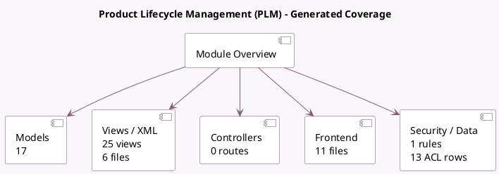

<!-- GENERATED:MODULE -->
---
tags: [odoo, enterprise, module]
---

# Product Lifecycle Management (PLM)

- Scope: Enterprise Addons
- Source: enterprise/mrp_plm
- Dependencies: [[docs/Community Addons/mrp/mrp|mrp]]

## Summary

Manage engineering change orders on products, bills of material

## Generated coverage

- Models: 17
- XML files with UI/data artifacts: 6
- Views: 25
- Actions: 13
- Menus: 14
- Rules (ir.rule): 1
- Access CSV entries: 13
- Controller units: 0
- Frontend asset files: 11

## Module map

## Detail notes

- Models: [[docs/Enterprise Addons/mrp_plm/Models|Models]] (17)
- Views and XML: [[docs/Enterprise Addons/mrp_plm/Views|Views]] (6 files)
- Frontend: [[docs/Enterprise Addons/mrp_plm/Frontend|Frontend]] (11 files)

## Key models

- `mrp.bom`
- `mrp.bom.byproduct`
- `mrp.bom.line`
- `mrp.eco`
- `mrp.eco.approval`
- `mrp.eco.approval.template`
- `mrp.eco.bom.change`
- `mrp.eco.routing.change`
- `mrp.eco.stage`
- `mrp.eco.tag`
- `mrp.eco.type`
- `mrp.production`

## Navigation

- [[../Enterprise Addons/Enterprise Addons|Back to scope]]
- [[../../docs/docs|Back to docs]]

<!-- GENERATED:MODULE -->

