<!-- GENERATED:MODEL -->
---
tags: [odoo, enterprise, generated, model]
---

# mrp.production

- Module: [[docs/Enterprise Addons/mrp_workorder/mrp_workorder|mrp_workorder]]
- Scope: Enterprise Addons
- Defined in module: extension only
- Source files: `models/mrp_production.py`
- Python classes: `MrpProduction`

## Field footprint

- Detected fields: 5
- Field types: `Boolean` x 1, `Integer` x 1, `Many2many` x 1, `One2many` x 1, `Text` x 1
- Relation fields: 2

## Sample fields

- `check_ids`: `One2many` (comodel `quality.check`)
- `employee_ids`: `Many2many` (comodel `hr.employee`, compute `_compute_employee_ids`)
- `log_note`: `Text`
- `picking_type_auto_close`: `Boolean` (related `picking_type_id.auto_close_production`)
- `state_color`: `Integer` (comodel `State Color`, compute `_compute_state_color`)

## Method hints

- Detected methods: 13
- Action methods: `action_add_byproduct`, `action_add_component`, `action_add_workorder`, `action_load_samples`, `action_log_note`, `action_open_shop_floor`
- Compute methods: `_compute_employee_ids`, `_compute_state_color`
- Onchange methods: none

## Direct relation diagram

```plantuml
@startuml
!define ODOO_COLOR_PRIMARY #714B67
!define ODOO_COLOR_ACCENT #875A7B
!define ODOO_COLOR_BG #FAF7FA

skinparam backgroundColor ODOO_COLOR_BG
skinparam defaultTextAlignment left
skinparam ArrowColor ODOO_COLOR_ACCENT
skinparam ClassBackgroundColor white
skinparam ClassBorderColor ODOO_COLOR_PRIMARY
skinparam ComponentBackgroundColor white
skinparam ComponentBorderColor ODOO_COLOR_PRIMARY
skinparam NoteBackgroundColor #FFF8FF
skinparam NoteBorderColor ODOO_COLOR_ACCENT
skinparam SequenceLifeLineBorderColor ODOO_COLOR_ACCENT
skinparam SequenceLifeLineBackgroundColor #FFFFFF
skinparam SequenceParticipantBorderColor ODOO_COLOR_PRIMARY
skinparam SequenceParticipantBackgroundColor #FFFFFF
skinparam sequence {
  ArrowColor ODOO_COLOR_ACCENT
  ActorBorderColor ODOO_COLOR_PRIMARY
}
title mrp.production - Direct Relations
class "mrp.production" as mrp_production
class "hr.employee" as hr_employee
class "quality.check" as quality_check
mrp_production --|> quality_check : check_ids
mrp_production .. hr_employee : employee_ids
@enduml
```

## Navigation

- **Parent:** [[docs/Enterprise Addons/mrp_workorder/Models]]

<!-- GENERATED:MODEL -->
