<!-- GENERATED:MODEL -->
---
tags: [odoo, enterprise, generated, model]
---

# mrp.routing.workcenter

- Module: [[docs/Enterprise Addons/mrp_workorder/mrp_workorder|mrp_workorder]]
- Scope: Enterprise Addons
- Defined in module: extension only
- Source files: `models/quality.py`
- Python classes: `MrpRoutingWorkcenter`

## Field footprint

- Detected fields: 4
- Field types: `Float` x 1, `Integer` x 1, `One2many` x 2
- Relation fields: 2

## Sample fields

- `default_picking_type_ids`: `One2many` (comodel `stock.picking.type`, compute `_compute_default_picking_type_ids`)
- `employee_ratio`: `Float` (comodel `Employee Capacity`)
- `quality_point_count`: `Integer` (comodel `Instructions`, compute `_compute_quality_point_count`)
- `quality_point_ids`: `One2many` (comodel `quality.point`)

## Method hints

- Detected methods: 5
- Action methods: none
- Compute methods: `_compute_cost`, `_compute_default_picking_type_ids`, `_compute_quality_point_count`
- Onchange methods: none

## Direct relation diagram

```plantuml
@startuml
!define ODOO_COLOR_PRIMARY #714B67
!define ODOO_COLOR_ACCENT #875A7B
!define ODOO_COLOR_BG #FAF7FA

skinparam backgroundColor ODOO_COLOR_BG
skinparam defaultTextAlignment left
skinparam ArrowColor ODOO_COLOR_ACCENT
skinparam ClassBackgroundColor white
skinparam ClassBorderColor ODOO_COLOR_PRIMARY
skinparam ComponentBackgroundColor white
skinparam ComponentBorderColor ODOO_COLOR_PRIMARY
skinparam NoteBackgroundColor #FFF8FF
skinparam NoteBorderColor ODOO_COLOR_ACCENT
skinparam SequenceLifeLineBorderColor ODOO_COLOR_ACCENT
skinparam SequenceLifeLineBackgroundColor #FFFFFF
skinparam SequenceParticipantBorderColor ODOO_COLOR_PRIMARY
skinparam SequenceParticipantBackgroundColor #FFFFFF
skinparam sequence {
  ArrowColor ODOO_COLOR_ACCENT
  ActorBorderColor ODOO_COLOR_PRIMARY
}
title mrp.routing.workcenter - Direct Relations
class "mrp.routing.workcenter" as mrp_routing_workcenter
class "quality.point" as quality_point
class "stock.picking.type" as stock_picking_type
mrp_routing_workcenter --|> quality_point : quality_point_ids
mrp_routing_workcenter --|> stock_picking_type : default_picking_type_ids
@enduml
```

## Navigation

- **Parent:** [[docs/Enterprise Addons/mrp_workorder/Models]]

<!-- GENERATED:MODEL -->
