<!-- GENERATED:MODEL -->
---
tags: [odoo, enterprise, generated, model]
---

# mrp.workcenter

- Module: [[docs/Enterprise Addons/mrp_workorder/mrp_workorder|mrp_workorder]]
- Scope: Enterprise Addons
- Defined in module: yes
- Source files: `models/mrp_workcenter.py`
- Python classes: `MrpWorkcenter`
- Inherits: `hr.mixin`

## Field footprint

- Detected fields: 3
- Field types: `Many2many` x 1, `Many2one` x 1, `Monetary` x 1
- Relation fields: 2

## Sample fields

- `currency_id`: `Many2one` (related `company_id.currency_id`)
- `employee_costs_hour`: `Monetary`
- `employee_ids`: `Many2many` (comodel `hr.employee`, store `True`)

## Method hints

- Detected methods: 4
- Action methods: `action_enable_routings`, `action_work_order`
- Compute methods: `_compute_working_state`
- Onchange methods: none

## Direct relation diagram

```plantuml
@startuml
!define ODOO_COLOR_PRIMARY #714B67
!define ODOO_COLOR_ACCENT #875A7B
!define ODOO_COLOR_BG #FAF7FA

skinparam backgroundColor ODOO_COLOR_BG
skinparam defaultTextAlignment left
skinparam ArrowColor ODOO_COLOR_ACCENT
skinparam ClassBackgroundColor white
skinparam ClassBorderColor ODOO_COLOR_PRIMARY
skinparam ComponentBackgroundColor white
skinparam ComponentBorderColor ODOO_COLOR_PRIMARY
skinparam NoteBackgroundColor #FFF8FF
skinparam NoteBorderColor ODOO_COLOR_ACCENT
skinparam SequenceLifeLineBorderColor ODOO_COLOR_ACCENT
skinparam SequenceLifeLineBackgroundColor #FFFFFF
skinparam SequenceParticipantBorderColor ODOO_COLOR_PRIMARY
skinparam SequenceParticipantBackgroundColor #FFFFFF
skinparam sequence {
  ArrowColor ODOO_COLOR_ACCENT
  ActorBorderColor ODOO_COLOR_PRIMARY
}
title mrp.workcenter - Direct Relations
class "mrp.workcenter" as mrp_workcenter
class "hr.employee" as hr_employee
mrp_workcenter .. hr_employee : employee_ids
@enduml
```

## Navigation

- **Parent:** [[docs/Enterprise Addons/mrp_workorder/Models]]

<!-- GENERATED:MODEL -->
