<!-- GENERATED:MODEL -->
---
tags: [odoo, enterprise, generated, model]
---

# mrp.workcenter.productivity

- Module: [[docs/Enterprise Addons/mrp_workorder/mrp_workorder|mrp_workorder]]
- Scope: Enterprise Addons
- Defined in module: extension only
- Source files: `models/mrp_workcenter.py`
- Python classes: `MrpWorkcenterProductivity`

## Field footprint

- Detected fields: 4
- Field types: `Float` x 1, `Many2one` x 2, `Monetary` x 1
- Relation fields: 2

## Sample fields

- `currency_id`: `Many2one` (related `company_id.currency_id`)
- `employee_cost`: `Monetary` (comodel `employee_cost`, compute `_compute_employee_cost`, store `True`)
- `employee_id`: `Many2one` (comodel `hr.employee`, compute `_compute_employee`, store `True`)
- `total_cost`: `Float` (comodel `Cost`, compute `_compute_total_cost`)

## Method hints

- Detected methods: 4
- Action methods: none
- Compute methods: `_compute_employee`, `_compute_employee_cost`, `_compute_total_cost`
- Onchange methods: none

## Direct relation diagram

```plantuml
@startuml
!define ODOO_COLOR_PRIMARY #714B67
!define ODOO_COLOR_ACCENT #875A7B
!define ODOO_COLOR_BG #FAF7FA

skinparam backgroundColor ODOO_COLOR_BG
skinparam defaultTextAlignment left
skinparam ArrowColor ODOO_COLOR_ACCENT
skinparam ClassBackgroundColor white
skinparam ClassBorderColor ODOO_COLOR_PRIMARY
skinparam ComponentBackgroundColor white
skinparam ComponentBorderColor ODOO_COLOR_PRIMARY
skinparam NoteBackgroundColor #FFF8FF
skinparam NoteBorderColor ODOO_COLOR_ACCENT
skinparam SequenceLifeLineBorderColor ODOO_COLOR_ACCENT
skinparam SequenceLifeLineBackgroundColor #FFFFFF
skinparam SequenceParticipantBorderColor ODOO_COLOR_PRIMARY
skinparam SequenceParticipantBackgroundColor #FFFFFF
skinparam sequence {
  ArrowColor ODOO_COLOR_ACCENT
  ActorBorderColor ODOO_COLOR_PRIMARY
}
title mrp.workcenter.productivity - Direct Relations
class "mrp.workcenter.productivity" as mrp_workcenter_productivity
class "hr.employee" as hr_employee
mrp_workcenter_productivity --> hr_employee : employee_id
@enduml
```

## Navigation

- **Parent:** [[docs/Enterprise Addons/mrp_workorder/Models]]

<!-- GENERATED:MODEL -->
