<!-- GENERATED:MODEL -->
---
tags: [odoo, enterprise, generated, model]
---

# mrp.workorder

- Module: [[docs/Enterprise Addons/mrp_workorder/mrp_workorder|mrp_workorder]]
- Scope: Enterprise Addons
- Defined in module: yes
- Source files: `models/mrp_workorder.py`
- Python classes: `MrpWorkorder`
- Inherits: `barcodes.barcode_events_mixin`, `hr.mixin`

## Field footprint

- Detected fields: 31
- Field types: `Binary` x 1, `Boolean` x 7, `Char` x 3, `Float` x 1, `Integer` x 3, `Many2many` x 7, `Many2one` x 5, `One2many` x 3, `Selection` x 1
- Relation fields: 15

## Sample fields

- `all_employees_allowed`: `Boolean` (compute `_all_employees_allowed`)
- `allow_producing_quantity_change`: `Boolean` (comodel `Allow Changes to Producing Quantity`)
- `allowed_employees`: `Many2many` (related `workcenter_id.employee_ids`)
- `check_ids`: `One2many` (comodel `quality.check`)
- `connected_employee_ids`: `Many2many` (comodel `hr.employee`, store `False`)
- `current_quality_check_id`: `Many2one` (comodel `quality.check`)
- `done_check_ids`: `Many2many` (comodel `quality.check`, compute `_compute_done_check_ids`)
- `employee_assigned_ids`: `Many2many` (comodel `hr.employee`)
- `employee_costs_hour`: `Float`
- `employee_id`: `Many2one` (comodel `hr.employee`, compute `_compute_employee_id`)
- `employee_ids`: `Many2many` (comodel `hr.employee`)
- `employee_name`: `Char` (compute `_compute_employee_id`)
- `finished_product_check_ids`: `Many2many` (comodel `quality.check`, compute `_compute_finished_product_check_ids`)
- `is_first_started_wo`: `Boolean` (comodel `Is The first Work Order`, compute `_compute_is_last_unfinished_wo`)
- `is_last_lot`: `Boolean` (comodel `Is Last lot`, compute `_compute_is_last_lot`)
- `is_last_unfinished_wo`: `Boolean` (comodel `Is Last Work Order To Process`, compute `_compute_is_last_unfinished_wo`, store `False`)
- `move_id`: `Many2one` (related `current_quality_check_id.move_id`)
- `move_line_ids`: `One2many` (related `move_id.move_line_ids`)
- `picture`: `Binary` (related `current_quality_check_id.picture`)
- `product_description_variants`: `Char` (related `production_id.product_description_variants`)

## Method hints

- Detected methods: 70
- Action methods: `action_add_byproduct`, `action_add_component`, `action_add_step`, `action_add_workorder`, `action_back`, `action_cancel`, `action_generate_serial`, `action_log_note`, and 6 more
- Compute methods: `_compute_check`, `_compute_current_operation_cost`, `_compute_done_check_ids`, `_compute_duration`, `_compute_employee_id`, `_compute_expected_operation_cost`, `_compute_finished_product_check_ids`, `_compute_is_last_lot`, and 4 more
- Onchange methods: none

## Direct relation diagram

```plantuml
@startuml
!define ODOO_COLOR_PRIMARY #714B67
!define ODOO_COLOR_ACCENT #875A7B
!define ODOO_COLOR_BG #FAF7FA

skinparam backgroundColor ODOO_COLOR_BG
skinparam defaultTextAlignment left
skinparam ArrowColor ODOO_COLOR_ACCENT
skinparam ClassBackgroundColor white
skinparam ClassBorderColor ODOO_COLOR_PRIMARY
skinparam ComponentBackgroundColor white
skinparam ComponentBorderColor ODOO_COLOR_PRIMARY
skinparam NoteBackgroundColor #FFF8FF
skinparam NoteBorderColor ODOO_COLOR_ACCENT
skinparam SequenceLifeLineBorderColor ODOO_COLOR_ACCENT
skinparam SequenceLifeLineBackgroundColor #FFFFFF
skinparam SequenceParticipantBorderColor ODOO_COLOR_PRIMARY
skinparam SequenceParticipantBackgroundColor #FFFFFF
skinparam sequence {
  ArrowColor ODOO_COLOR_ACCENT
  ActorBorderColor ODOO_COLOR_PRIMARY
}
title mrp.workorder - Direct Relations
class "mrp.workorder" as mrp_workorder
class "hr.employee" as hr_employee
class "quality.alert" as quality_alert
class "quality.check" as quality_check
class "quality.point" as quality_point
class "quality.point.test_type" as quality_point_test_type
mrp_workorder .. quality_point : quality_point_ids
mrp_workorder --|> quality_check : check_ids
mrp_workorder .. quality_check : finished_product_check_ids
mrp_workorder .. quality_check : done_check_ids
mrp_workorder --|> quality_alert : quality_alert_ids
mrp_workorder --> quality_check : current_quality_check_id
mrp_workorder --> quality_point_test_type : test_type_id
mrp_workorder --> hr_employee : employee_id
mrp_workorder .. hr_employee : employee_ids
mrp_workorder .. hr_employee : employee_assigned_ids
mrp_workorder .. hr_employee : connected_employee_ids
@enduml
```

## Navigation

- **Parent:** [[docs/Enterprise Addons/mrp_workorder/Models]]

<!-- GENERATED:MODEL -->
