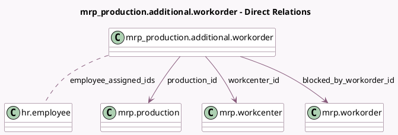

<!-- GENERATED:MODEL -->
---
tags: [odoo, enterprise, generated, model]
---

# mrp_production.additional.workorder

- Module: [[docs/Enterprise Addons/mrp_workorder/mrp_workorder|mrp_workorder]]
- Scope: Enterprise Addons
- Defined in module: yes
- Source files: `wizard/additional_workorder.py`
- Python classes: `Mrp_ProductionAdditionalWorkorder`
- Description: Additional Workorder

## Field footprint

- Detected fields: 8
- Field types: `Char` x 1, `Datetime` x 1, `Float` x 1, `Many2many` x 1, `Many2one` x 4
- Relation fields: 5

## Sample fields

- `blocked_by_workorder_id`: `Many2one` (comodel `mrp.workorder`)
- `company_id`: `Many2one` (related `production_id.company_id`)
- `date_start`: `Datetime` (comodel `Date Start`)
- `duration_expected`: `Float` (comodel `Expected Duration`)
- `employee_assigned_ids`: `Many2many` (comodel `hr.employee`)
- `name`: `Char` (comodel `Title`)
- `production_id`: `Many2one` (comodel `mrp.production`)
- `workcenter_id`: `Many2one` (comodel `mrp.workcenter`)

## Method hints

- Detected methods: 1
- Action methods: none
- Compute methods: none
- Onchange methods: none

## Direct relation diagram

## Navigation

- **Parent:** [[docs/Enterprise Addons/mrp_workorder/Models]]

<!-- GENERATED:MODEL -->
