<!-- GENERATED:MODEL -->
---
tags: [odoo, enterprise, generated, model]
---

# propose.change

- Module: [[docs/Enterprise Addons/mrp_workorder/mrp_workorder|mrp_workorder]]
- Scope: Enterprise Addons
- Defined in module: yes
- Source files: `wizard/propose_change.py`
- Python classes: `ProposeChange`
- Description: Propose a change in the production

## Field footprint

- Detected fields: 7
- Field types: `Binary` x 1, `Char` x 2, `Html` x 1, `Many2one` x 2, `Selection` x 1
- Relation fields: 2

## Sample fields

- `change_type`: `Selection`
- `comment`: `Char` (comodel `Comment`)
- `note`: `Html` (comodel `New Instruction`)
- `picture`: `Binary` (comodel `Picture`)
- `step_id`: `Many2one` (comodel `quality.check`)
- `title`: `Char` (comodel `Title`)
- `workorder_id`: `Many2one` (comodel `mrp.workorder`)

## Method hints

- Detected methods: 10
- Action methods: none
- Compute methods: none
- Onchange methods: none

## Direct relation diagram

```plantuml
@startuml
!define ODOO_COLOR_PRIMARY #714B67
!define ODOO_COLOR_ACCENT #875A7B
!define ODOO_COLOR_BG #FAF7FA

skinparam backgroundColor ODOO_COLOR_BG
skinparam defaultTextAlignment left
skinparam ArrowColor ODOO_COLOR_ACCENT
skinparam ClassBackgroundColor white
skinparam ClassBorderColor ODOO_COLOR_PRIMARY
skinparam ComponentBackgroundColor white
skinparam ComponentBorderColor ODOO_COLOR_PRIMARY
skinparam NoteBackgroundColor #FFF8FF
skinparam NoteBorderColor ODOO_COLOR_ACCENT
skinparam SequenceLifeLineBorderColor ODOO_COLOR_ACCENT
skinparam SequenceLifeLineBackgroundColor #FFFFFF
skinparam SequenceParticipantBorderColor ODOO_COLOR_PRIMARY
skinparam SequenceParticipantBackgroundColor #FFFFFF
skinparam sequence {
  ArrowColor ODOO_COLOR_ACCENT
  ActorBorderColor ODOO_COLOR_PRIMARY
}
title propose.change - Direct Relations
class "propose.change" as propose_change
class "mrp.workorder" as mrp_workorder
class "quality.check" as quality_check
propose_change --> mrp_workorder : workorder_id
propose_change --> quality_check : step_id
@enduml
```

## Navigation

- **Parent:** [[docs/Enterprise Addons/mrp_workorder/Models]]

<!-- GENERATED:MODEL -->
